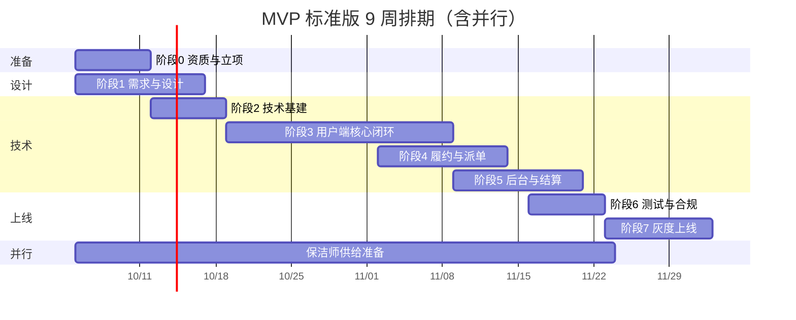

# 家政清洁服务小程序 · MVP 实施步骤与任务拆解

| 项目 | 内容 |
| --- | --- |
| 文档名称 | 家政清洁服务小程序 MVP 实施步骤与任务拆解 |
| 配套文档 | 《家政清洁服务小程序-设计文档.md》 |
| 版本 | V1.0 |
| 日期 | 2026-10-03 |
| 用途 | 把项目从"想法"落到"可执行的每周任务"，供负责人逐项打勾推进 |

---

## 0. 这份拆解怎么用

整个项目只有三件事要同时盯着：

1. **先定 5 个决策**（第 1 章，1–2 天能定完）；
2. **立刻启动长周期的资质流程**（营业执照、小程序认证、域名备案、微信支付商户号，这些动辄 2–4 周，是最大的隐形延期源）；
3. **按 7 个阶段推进**，每个阶段有明确的交付物和"完成标准"（Done 的定义），不做完不进入下一阶段。

任务编号规则：`Z0` 表示阶段 0，`Z0-03` 表示该阶段第 3 项任务，方便在会议和群里直接引用。

任务状态只有 5 种，建议每周更新一次：

| 状态 | 含义 |
| --- | --- |
| 待开始 | 还没动 |
| 进行中 | 有人在做 |
| 阻塞 | 卡住了，需要决策或外部资源（每周例会只重点看这一类） |
| 已完成 | 交付物产出，但还没验收 |
| 已验证 | 通过了验收标准，真正关闭 |

**推进节奏**：每周一次 30 分钟例会，只看"阻塞"和"逾期"两类任务；每个里程碑做一次半天复盘。

---

## 1. 开工前必须拍板的 5 件事（1–2 天）

这 5 个决策会直接决定后面的工作量、成本和周期，先定下来再开发，否则会反复返工。

| 序号 | 决策项 | 可选项 | 默认建议 | 影响 |
| --- | --- | --- | --- | --- |
| D1 | 经营主体 | 个人 / 个体工商户 / 有限公司 | **有限公司**（或个体户） | 个人主体无法开通微信支付，必须用企业或个体户 |
| D2 | 起步范围 | 全国 / 单城多区 / 单城单区 | **单城 1–2 个区** | 范围越大，保洁师供给和调度越难，MVP 越小越好 |
| D3 | 保洁师端形态 | 同一小程序身份切换 / 独立小程序 / 微信群人工派单 | **同一小程序身份切换**（省钱） | 独立小程序体验好但开发与审核成本翻倍 |
| D4 | 建设方式 | 自研 / 外包 / 买现成 SaaS | 看预算，见第 12 章三档方案 | 决定周期是 4 周还是 12 周 |
| D5 | 首批服务与价格 | 1 个品类 / 2–3 个品类 | **日常保洁 + 家电清洗** | 品类越多，服务标准和供给要求越高 |

**同时确定**：项目预算上限、期望上线时间、项目负责人（一个人拍板，避免多头决策）。

---

## 2. 整体路线图（7 个阶段）



| 阶段 | 周期 | 目标 | 关键交付物 | 完成标准（Done） |
| --- | --- | --- | --- | --- |
| 阶段 0 资质与立项 | 第 1 周（持续 2–4 周） | 把所有长周期手续启动 | 主体资质、小程序账号、备案、支付商户号申请回执 | 备案已提交、商户号已申请、小程序账号已认证 |
| 阶段 1 需求与设计 | 第 1–2 周 | 范围锁定、界面定型 | 原型、UI 稿、接口与表结构评审通过 | 原型可点击走通"选服务→下单→支付" |
| 阶段 2 技术基建 | 第 2 周 | 地基打好，后面不返工 | 环境、仓库、登录鉴权、数据库、统一规范 | 能跑通"登录→拉配置→返回数据" |
| 阶段 3 用户端核心闭环 | 第 3–5 周 | **最关键的阶段**：用户能付钱 | 首页、服务、地址、时段、下单、支付、订单、改期退款 | 用真实微信支付完成 1 单（可 1 分钱测试） |
| 阶段 4 履约与派单 | 第 5–6 周 | 钱收了，人真的能上门 | 派单、保洁师接单、签到、完工、通知、超时退款 | 完整跑通一单真实服务并完成评价 |
| 阶段 5 后台与结算 | 第 6–7 周 | 运营能自己管，不靠开发 | 订单管理、配置、保洁师管理、结算、看板 | 运营能独立配置价格并处理一笔异常单 |
| 阶段 6 测试与合规 | 第 7 周 | 上线前把坑踩完 | 测试报告、压测结果、合规清单、应急预案 | 上线检查表全部通过 |
| 阶段 7 灰度上线 | 第 8–9 周 | 小范围验证，再放量 | 灰度数据、复盘报告、二期清单 | 灰度 200 单完成率 ≥ 95%，差评率 ≤ 3% |

> 重要：**阶段 0 和阶段 1 必须并行**。等资质全部下来再开始设计和开发，项目会白白多花 3 周。

---

## 3. 阶段 0：资质与立项准备（第 1 周启动，周期最长）

**为什么单独成阶段**：以下手续的审批周期是外部的、你控制不了的，越早提交越好。设计开发可以同步进行，但不能等。

| 编号 | 任务 | 具体做什么 | 产出物 | 预估 | 负责 | 验收标准 |
| --- | --- | --- | --- | --- | --- | --- |
| Z0-01 | 主体资质确认 | 确认/注册营业执照，经营范围包含家政服务或生活服务 | 营业执照 | 3–15 天（外部） | 负责人 | 执照到手且经营范围匹配 |
| Z0-02 | 对公账户 | 开立企业/个体户对公账户（支付与结算必需） | 对公账户 | 3–7 天 | 负责人 | 可正常收款 |
| Z0-03 | 小程序账号注册与认证 | 注册小程序，完成企业认证（300 元/年） | 小程序 AppID | 1–3 天 | 负责人 | 认证通过，可添加开发者 |
| Z0-04 | 类目与资质提交 | 选择"生活服务/家政"类目，提交所需资质材料 | 类目审核通过 | 1–7 天 | 负责人 | 类目显示"已通过" |
| Z0-05 | 域名购买与 ICP 备案 | 买域名、买服务器、提交备案（境内服务器必做） | 备案号 | 10–20 天（外部） | 技术 | 备案通过，域名可 https 访问 |
| Z0-06 | 微信支付商户号申请 | 提交商户资料，与小程序 AppID 关联 | 商户号 MchID + API 证书 | 1–5 天 | 负责人 + 技术 | 能成功调用统一下单接口 |
| Z0-07 | 第三方账号开通 | 腾讯位置服务、短信服务、对象存储、实名认证 | 各平台 AppKey | 1 天 | 技术 | 密钥可正常调用 |
| Z0-08 | 服务标准与定价定稿 | 确定每项服务的包含项、不包含项、时长、价格、附加费 | 《服务标准与价格表》 | 1–2 天 | 运营 | 文案可直接上线使用 |
| Z0-09 | 保洁师准入标准 | 明确招募条件、证件要求、审核流程、分成比例、考核规则 | 《保洁师管理规范》 | 1–2 天 | 运营 | 培训时可直接讲 |
| Z0-10 | 法律文本起草 | 用户协议、隐私政策、服务条款、取消与赔付规则 | 4 份文本 | 1–2 天 | 负责人 | 可在小程序内展示 |
| Z0-11 | 保洁师招募启动 | 发布招募信息（本地社群、中介、兼职平台） | 首批意向名单 | 持续 | 运营 | 意向 ≥ 30 人 |

**本阶段最常见的坑**

- 用个人主体注册小程序 → 后期无法开通微信支付，只能重建，损失 2 周以上。
- 备案没通过就用国内服务器 → 接口无法上线，务必提前提交。
- 家政类目资质没准备 → 小程序审核被驳回，反复提交会拖慢上线。

---

## 4. 阶段 1：需求与设计（第 1–2 周）

目标是**把不确定性消灭在纸面上**，避免开发到一半改需求。

| 编号 | 任务 | 具体做什么 | 产出物 | 预估 | 负责 | 验收标准 |
| --- | --- | --- | --- | --- | --- | --- |
| Z1-01 | MVP 范围确认会 | 逐条确认设计文档 1.3 的范围，明确不做什么 | 范围确认纪要 | 0.5 天 | 全员 | 各方签字确认 |
| Z1-02 | 核心业务流程梳理 | 确认下单流程、派单规则、取消改期规则 | 流程图 | 1 天 | 产品 | 与设计文档一致 |
| Z1-03 | 原型设计（用户端） | 首页、服务详情、下单、支付结果、订单列表/详情、改期、评价、我的、地址 | 可点击原型 | 3–4 天 | 产品 | 能点击串通完整下单流程 |
| Z1-04 | 原型设计（保洁师端） | 任务列表、接单、签到、完工上传、收入 | 可点击原型 | 1–2 天 | 产品 | 保洁师可独立操作 |
| Z1-05 | 原型设计（后台） | 订单管理、服务配置、派单、保洁师、结算、看板 | 后台原型 | 2–3 天 | 产品 | 运营确认可完成日常操作 |
| Z1-06 | UI 视觉设计 | 主色、组件、关键页面视觉稿 | UI 稿 + 设计规范 | 3–5 天 | 设计 | 开发可直接切图实现 |
| Z1-07 | 数据库设计评审 | 按设计文档第 8 章建表结构，评审字段与索引 | 建表 SQL | 1–2 天 | 技术 | 评审通过，无遗漏字段 |
| Z1-08 | 接口设计评审 | 按设计文档第 9 章确定接口清单与出参 | 接口文档 | 1–2 天 | 技术 | 前后端确认无异议 |
| Z1-09 | 测试用例大纲 | 列出核心场景与异常场景用例清单 | 测试用例文档 | 1–2 天 | 测试 | 覆盖支付、退款、派单、异常 |
| Z1-10 | 排期确认 | 把本拆解落到具体人和具体日期 | 排期表 | 0.5 天 | 负责人 | 每人知道自己本周做什么 |

**完成标准**：原型可以点击走通"首页 → 选服务 → 选时间地址 → 支付"和"保洁师接单 → 签到 → 完工"两条主流程，运营看过后台原型并确认可用。

---

## 5. 阶段 2：技术基建（第 2 周，与阶段 1 并行）

这一周不追求业务功能，只求后面开发顺畅、不返工。

| 编号 | 任务 | 具体做什么 | 产出物 | 预估 | 负责 | 验收标准 |
| --- | --- | --- | --- | --- | --- | --- |
| Z2-01 | 代码仓库与分支规范 | 建仓库、定分支策略、代码评审规则 | 仓库 + 规范文档 | 0.5 天 | 技术 | 全员可提交代码 |
| Z2-02 | 环境搭建 | dev / test 环境、数据库、Redis、对象存储 | 可访问的环境 | 1–2 天 | 技术 | 部署脚本可一键执行 |
| Z2-03 | 数据库建表 | 执行建表 SQL，初始化基础数据 | 数据库 | 1 天 | 技术 | 表结构与评审一致 |
| Z2-04 | 登录鉴权 | 微信登录、JWT 签发与刷新、手机号绑定 | 登录接口 | 1–2 天 | 技术 | 小程序可拿到登录态 |
| Z2-05 | 统一规范 | 请求封装、统一响应、错误码、日志、埋点 | 公共模块 | 1–2 天 | 技术 | 新接口按模板即可开发 |
| Z2-06 | 后台框架与权限 | 后台登录、菜单、角色权限、审计日志 | 后台骨架 | 2 天 | 技术 | 不同角色看到不同菜单 |
| Z2-07 | 支付与第三方联调准备 | 支付沙箱、地图 Key、短信签名、存储桶 | 联调环境 | 1 天 | 技术 | 各接口能返回测试结果 |
| Z2-08 | CI/CD 与发布流程 | 自动构建、测试环境自动部署 | 发布流水线 | 1 天 | 技术 | 提交代码可自动部署 |

**完成标准**：小程序端能完成登录，调用一个测试接口拿到后端数据，并成功写入数据库。

---

## 6. 阶段 3：用户端核心闭环（第 3–5 周，关键路径）

**这是整个项目最重要的一段**：只要用户能顺利完成"选服务 → 支付 → 看到订单"，商业闭环就成立了一半。建议严格按下面顺序开发，不要并行插队。

| 编号 | 任务 | 具体做什么 | 产出物 | 预估 | 依赖 | 验收标准 |
| --- | --- | --- | --- | --- | --- | --- |
| Z3-01 | 首页与配置 | 定位、品类宫格、活动位、保障说明、常约卡片 | 首页 | 2 天 | Z2-05 | 不同城市/区域展示正确 |
| Z3-02 | 服务列表与详情 | 分类、服务详情、规格选择、附加项、评价展示 | 服务模块 | 2–3 天 | Z3-01 | 规格切换价格随之变化 |
| Z3-03 | 地址管理 | 地址列表、编辑、地图选点、微信地址导入 | 地址模块 | 2 天 | Z2-04 | 可保存并设为默认地址 |
| Z3-04 | 服务范围校验 | 按行政区/小区白名单判断是否可服务 | 校验接口 | 1 天 | Z3-03 | 范围外明确提示 |
| Z3-05 | 时段查询与库存 | 日期选择、时段余量、已满置灰、最早可用提示 | 时段组件 | 2–3 天 | Z2-03 | 并发下不出现超卖 |
| Z3-06 | 价格试算 | 服务费 + 附加项 + 楼层/里程 + 券抵扣 | 试算接口 | 1–2 天 | Z3-02 | 与支付金额完全一致 |
| Z3-07 | 创建订单 | 下单、幂等、时段预占 15 分钟 | 下单接口 | 2 天 | Z3-05、Z3-06 | 重复点击只生成 1 单 |
| Z3-08 | 微信支付 | 统一下单、唤起支付、回调验签、订单状态更新 | 支付模块 | 2–3 天 | Z0-06 | 真实支付 1 分钱成功 |
| Z3-09 | 订单列表与详情 | 分状态 Tab、状态条、保洁师信息、费用明细 | 订单模块 | 2–3 天 | Z3-07 | 状态与实际一致 |
| Z3-10 | 取消与改期 | 规则展示、费用试算、退款发起、进度查询 | 取消/改期 | 2–3 天 | Z3-08 | 退款金额与规则一致 |
| Z3-11 | 我的与消息中心 | 账户、优惠券、积分、站内消息 | 个人中心 | 2 天 | Z2-04 | 数据展示正确 |
| Z3-12 | 优惠券 | 领券、用券、核销、回滚 | 营销模块 | 1–2 天 | Z3-06 | 同券不可重复使用 |

**里程碑 M1（第 5 周末）**：用真实微信支付完成一笔 1 分钱测试订单，并能成功退款。这一步不通，后面全部没有意义，**必须优先打通**。

> 建议：支付联调不要留到最后。第 3 周就把"1 分钱支付 + 退款"跑通，可以提前暴露商户号、证书、回调域名等一堆外部问题。

---

## 7. 阶段 4：履约与派单（第 5–6 周）

用户付完钱之后，真正的难点在"人能不能按时上门"。

| 编号 | 任务 | 具体做什么 | 产出物 | 预估 | 依赖 | 验收标准 |
| --- | --- | --- | --- | --- | --- | --- |
| Z4-01 | 派单服务 | 硬性过滤 + 打分排序 + Top N 顺序派发 | 派单引擎 | 3 天 | Z3-08 | 订单可自动分给合适保洁师 |
| Z4-02 | 人工派单兜底 | 后台待派单池、手动指派、改派 | 调度中心 | 2 天 | Z5-01 | 运营可一键改派 |
| Z4-03 | 保洁师任务列表 | 待接单、待服务、服务中、已完成 | 保洁师端 | 2–3 天 | Z4-01 | 保洁师可看到自己的订单 |
| Z4-04 | 接单与拒单 | 接单、拒单（带原因）、超时自动流转 | 接单流程 | 2 天 | Z4-03 | 拒单后自动重新派单 |
| Z4-05 | 出发与签到 | 出发打卡、定位校验（500m）、弱网重试 | 签到模块 | 2–3 天 | Z4-03 | 超出范围无法签到 |
| Z4-06 | 完工与服务记录 | 上传完工照片、服务清单勾选 | 完工提交 | 2 天 | Z4-05 | 照片成功上传并可查看 |
| Z4-07 | 用户确认与自动确认 | 用户确认完工、48 小时自动确认 | 确认流程 | 1–2 天 | Z4-06 | 到期自动流转 |
| Z4-08 | 订阅消息通知 | 下单成功、已接单、上门提醒、完工、退款；保洁师新任务 | 通知模块 | 2–3 天 | Z2-07 | 各节点收到消息 |
| Z4-09 | 超时未接单自动退款 | 定时任务扫描 + 全额退款 + 发券 | 兜底逻辑 | 1–2 天 | Z3-10 | 超时订单自动退款成功 |
| Z4-10 | 评价与工单 | 星级标签评价、投诉工单、客服处理 | 评价与工单 | 2–3 天 | Z4-07 | 差评可触发客服跟进 |

**里程碑 M2（第 6 周末）**：完整跑通一单真实服务——真实用户下单、真实保洁师接单上门、签到、完工、用户确认、评价，全程无人工改数据库。

---

## 8. 阶段 5：后台、结算与营销（第 6–7 周）

目标：**让运营不用找开发就能干活**。

| 编号 | 任务 | 具体做什么 | 产出物 | 预估 | 依赖 | 验收标准 |
| --- | --- | --- | --- | --- | --- | --- |
| Z5-01 | 订单管理 | 查询、筛选、详情、改派、强制取消、备注 | 订单后台 | 3 天 | Z3-07 | 运营可处理异常单 |
| Z5-02 | 服务与价格配置 | 分类、服务、SKU、附加项、上下架 | 商品后台 | 2–3 天 | Z3-02 | 改价后小程序实时生效 |
| Z5-03 | 时段与区域配置 | 时段库存、服务区域、节假日加价 | 配置后台 | 2 天 | Z3-05 | 运营可自行开放/关闭时段 |
| Z5-04 | 保洁师管理 | 入驻审核、证件管理、技能标签、考核、封禁 | 保洁师后台 | 2–3 天 | Z4-03 | 可审核通过并派单 |
| Z5-05 | 财务与退款审批 | 收款明细、退款审批、对账单 | 财务后台 | 2–3 天 | Z3-10 | 退款金额准确可追溯 |
| Z5-06 | 结算单 | 按周期生成结算、扣款项、导出 | 结算模块 | 2–3 天 | Z5-05 | 结算金额与订单可逐条核对 |
| Z5-07 | 优惠券与活动 | 券模板、发放、活动配置 | 营销后台 | 2 天 | Z3-12 | 可配置新客首单券 |
| Z5-08 | 数据看板 | 订单、GMV、转化率、准时率、差评率 | 看板 | 2–3 天 | Z5-01 | 数据与订单一致 |
| Z5-09 | 权限与审计日志 | 角色权限、敏感操作留痕 | 系统管理 | 2 天 | Z2-06 | 退款/改价有完整记录 |

**里程碑 M3（第 7 周末）**：运营人员在不看代码、不找开发的前提下，独立完成"上架一个新服务 → 配置时段 → 处理一笔异常订单 → 生成结算单"。

---

## 9. 阶段 6：测试与合规（第 7 周）

| 编号 | 任务 | 具体做什么 | 产出物 | 预估 | 验收标准 |
| --- | --- | --- | --- | --- | --- |
| Z6-01 | 功能测试 | 按用例覆盖全部核心与异常场景 | 测试报告 | 3–4 天 | 严重缺陷为 0 |
| Z6-02 | 支付与退款回归 | 成功、失败、取消、重复回调、部分退款、退款失败 | 回归报告 | 2 天 | 金额与状态全部正确 |
| Z6-03 | 并发压测 | 100 并发抢同一时段，验证不超卖 | 压测报告 | 1 天 | 无超卖、无重复订单 |
| Z6-04 | 兼容性测试 | iOS/Android 主流机型、小屏、弱网 | 兼容报告 | 1–2 天 | 无阻断性问题 |
| Z6-05 | 安全与合规自查 | 对照设计文档第 12 章逐项检查 | 合规清单 | 1–2 天 | 全部符合 |
| Z6-06 | 应急预案演练 | 模拟支付故障、无人接单、保洁师爽约 | 演练记录 | 1 天 | 每种情况有明确处置人 |
| Z6-07 | 客服与话术培训 | 常见问题、赔付标准、工单流程 | 培训记录 | 1 天 | 客服可独立处理 |
| Z6-08 | 灰度方案与回滚预案 | 确定灰度范围、放量节奏、回滚触发条件 | 上线方案 | 0.5 天 | 已评审 |

**完成标准**：设计文档 17.3 的《上线前 Checklist》全部打勾。

---

## 10. 阶段 7：灰度上线与运营启动（第 8–9 周）

不要一上线就大规模推广。按下面的节奏放量，风险可控。

| 编号 | 任务 | 具体做什么 | 时间 | 目标 |
| --- | --- | --- | --- | --- |
| Z7-01 | 内部内测 | 员工/亲友下单，真实履约 20–50 单 | 第 8 周前半 | 找出流程漏洞 |
| Z7-02 | 小范围灰度 | 开放 1 个区域，每天限量 20 单 | 第 8 周后半 | 履约稳定 |
| Z7-03 | 数据监控 | 每日看支付成功率、准时率、差评、退款 | 持续 | 异常当天处理 |
| Z7-04 | 保洁师扩充 | 按订单量补充供给，保持 1:3 冗余 | 持续 | 不出现无人接单 |
| Z7-05 | 首单活动上线 | 新客首单券、老带新 | 第 9 周 | 拉动首批用户 |
| Z7-06 | 放量 | 逐步开放全城，日单量按周翻倍 | 第 9 周起 | 稳定增长 |
| Z7-07 | 复盘与二期规划 | 总结数据与问题，确定二期功能 | 第 9 周末 | 输出二期需求 |

**灰度达标线（不达标不放量）**

| 指标 | 达标线 |
| --- | --- |
| 支付成功率 | ≥ 90% |
| 准时上门率 | ≥ 90% |
| 订单完成率 | ≥ 95% |
| 差评率 | ≤ 3% |
| 无人接单导致的退款 | ≤ 5% |

---

## 11. 供给侧准备计划（最容易忽略、却最容易致命）

很多项目上线后没人接单，不是因为系统不行，而是保洁师没准备好。**这项工作必须从第 1 周就和开发并行。**

| 时间 | 动作 | 目标数量 |
| --- | --- | --- |
| 第 1–2 周 | 确定准入标准、分成比例、招募渠道，启动招募 | 意向 30 人 |
| 第 3–4 周 | 完成实名与证件审核，签署协议 | 审核通过 15 人 |
| 第 5–6 周 | 服务标准培训 + 小程序使用培训 + 跟单试跑 | 可接单 10 人 |
| 第 7 周 | 全流程演练，处理拒单/迟到等异常 | 可接单 20 人 |
| 第 8–9 周 | 按订单量补充，保持供给冗余 | 可接单 30 人 |

**供给健康度底线**：任一时段可接单保洁师数 ≥ 该时段预计订单数 × 3。

**培训必讲内容**：服务包含与不包含项、超范围如何线上加项、签到与拍照规范、迟到与爽约的后果、隐私号使用规范、禁止私下加用户微信。

---

## 12. 三档建设方案（按预算和时间选一档）

| 方案 | 周期 | 成本参考 | 适合谁 | 取舍 |
| --- | --- | --- | --- | --- |
| 轻量版 | 3–4 周 | 最低 | 想先验证市场、预算有限 | 买现成家政 SaaS 或模板小程序；派单靠人工微信群；数据不在自己手里 |
| 标准版 | 8–10 周 | 中等 | 认真做这门生意、要有自己的用户资产 | 按本文档 7 阶段执行；核心系统自研或外包；功能覆盖 MVP 全部 |
| 完整版 | 12–16 周 | 较高 | 目标多城市、引入第三方家政公司 | 在标准版基础上增加分账、加盟、多城市、自动结算、发票 |

**建议**：先用轻量版或标准版跑通 200 单，验证"有人买、有人做、能赚钱"，再投入完整版。绝大多数失败的项目不是死在功能少，而是死在没订单或没供给。

**外包注意**：签约时明确交付物包含源代码、数据库脚本、部署文档、接口文档；分期付款（3:4:3）；验收标准写清"完成标准"里的内容，不要只写"开发完成"。

---

## 13. 关键路径与并行安排

**关键路径（任何一环延误都会推迟上线）**

```
营业执照 → 微信支付商户号 → 支付接入 → 下单支付闭环 → 派单 → 履约 → 灰度上线
```

**可以并行推进的**

- 资质申请（阶段 0）与需求设计（阶段 1）并行；
- 后台配置功能（阶段 5）与用户端开发（阶段 3）部分并行；
- 保洁师招募与培训，从第 1 周开始全程并行；
- UI 设计完成后即可开始前端开发，不必等接口全部就绪（可用 mock 数据）。

**能外包的**：UI 设计、后台前端、测试。
**不建议外包的**：派单规则、定价规则、用户与订单数据处理——这些是业务核心，后续迭代最频繁。

---

## 14. 常见坑与应对（都是真实会踩的）

| 坑 | 后果 | 应对 |
| --- | --- | --- |
| 用个人主体注册小程序 | 无法开通支付，只能重建 | 一开始就用企业/个体户 |
| 备案没下来才开始开发 | 上线被卡 2–3 周 | 第 1 天就提交备案 |
| 支付联调留到最后 | 商户号、证书、回调问题集中爆发 | 第 3 周先跑通 1 分钱支付 + 退款 |
| 时段不锁库存 | 同一时段被多人下单 | Redis 原子扣减 + 数据库乐观锁 |
| 订阅消息当短信发 | 用户收不到关键通知 | 多节点引导授权 + 站内消息 + 短信兜底 |
| 定价太低 | 保洁师不愿接单 | 先算清成本：人工 + 通勤 + 平台抽成 + 保险 |
| 服务范围写不清 | 现场扯皮、差评 | 详情页明示包含项与不包含项，超范围走线上加项 |
| 用户和保洁师私下成交 | 平台被绕开 | 隐私号、禁止交换联系方式、次卡绑定 |
| 无兜底派单 | 无人接单导致大量退款 | 系统派单 + 抢单池 + 人工兜底 + 超时自动退款 |
| 一上线就大推 | 供给跟不上，体验崩塌 | 先内测、再单区灰度、按周放量 |
| 没有客服值守 | 差评与投诉失控 | 上线首月保证 9:00–21:00 有人响应 |
| 退款规则模糊 | 纠纷与资金风险 | 规则外显，取消前展示可退金额 |

---

## 15. 进度跟踪模板

### 15.1 周例会固定议程（30 分钟）

1. 上周里程碑是否达成？未达成的原因是什么？（5 分钟）
2. 当前"阻塞"任务有哪些？谁负责、什么时候解决？（10 分钟）
3. 本周要完成的任务清单（对应本文档编号）？（10 分钟）
4. 风险登记表更新与决策事项（5 分钟）

### 15.2 风险登记表模板

| 编号 | 风险描述 | 影响 | 概率 | 应对措施 | 责任人 | 状态 |
| --- | --- | --- | --- | --- | --- | --- |
| R-01 | 备案审核超期 | 上线延期 | 中 | 提前提交，先用测试域名开发 | 待填写 | 跟踪中 |
| R-02 | 保洁师招募不足 | 无人接单 | 高 | 提高分成、保底补贴、拓展渠道 | 待填写 | 跟踪中 |
| R-03 | 支付商户审核被驳回 | 无法收款 | 中 | 提前核对资料完整性 | 待填写 | 跟踪中 |

### 15.3 每周进度表模板

| 任务编号 | 任务名称 | 负责人 | 计划完成 | 实际完成 | 状态 | 备注 |
| --- | --- | --- | --- | --- | --- | --- |
| Z3-08 | 微信支付接入 | 待填写 | 第 4 周 | — | 进行中 | 证书已申请 |

---

## 16. 今天就能开始的 3 件事

不管预算多少、团队几个人，下面三件事从今天就可以动：

1. **确认经营主体**，如果还没有营业执照，今天就去了解注册流程（这是所有事情的前提，周期最长）。
2. **注册小程序账号并提交企业认证**，同时把域名买好、提交备案（备案可以边开发边等）。
3. **把首批服务标准和价格写出来**：每项服务做什么、不做什么、多长时间、多少钱、加收哪些费用。这份文档会直接变成小程序里的商品页面。

做完这三件事，再回到本文档第 1 章定那 5 个决策，就可以正式排期开工了。

---

**文档结束**。建议配套使用《家政清洁服务小程序-设计文档.md》做技术依据，本文档做执行计划，每周更新任务状态。

| 版本 | 日期 | 修订人 | 说明 |
| --- | --- | --- | --- |
| V1.0 | 2026-10-03 | — | 初稿 |
