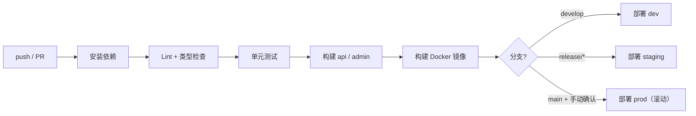

# 家政清洁服务小程序 · 代码项目开发计划书

| 项目 | 内容 |
| --- | --- |
| 文档名称 | 家政清洁服务小程序 代码项目开发计划书 |
| 文档定位 | 面向开发的工程实施方案，可直接作为排期、分工与评审依据 |
| 配套文档 | 《设计文档》（What/Why）、《MVP 实施步骤》（排期）、《本文档》（How） |
| 版本 | V1.0 |
| 日期 | 2026-10-03 |
| 范围说明 | **本文只覆盖代码交付**：技术选型、工程结构、模块设计、接口契约、开发顺序、测试与部署。资质、备案、商户申请、运营与招募不在本文范围内（假定已具备或可临时用测试方案替代） |

---

## 0. 项目交付目标（Definition of Success）

代码层面的成功标准，一句话：**一个真实用户可以完成下单支付，一个真实保洁师可以接单上门，运营可以在后台处理全过程，全流程无需人工改数据库。**

拆成可验证的 5 条：

| 编号 | 目标 | 验证方式 |
| --- | --- | --- |
| G1 | 用户端可完成"选服务 → 选时段 → 支付 → 查看订单 → 取消/退款" | 真机手工验证 + 自动化用例 |
| G2 | 保洁师端可完成"接单 → 出发 → 签到 → 完工上传"，用户可确认并评价 | 真机双端联调 |
| G3 | 后台可完成"订单处理 → 派单 → 退款 → 配置服务与时段 → 生成结算" | 运营人员独立操作验证 |
| G4 | 关键数据不重复、不超卖、不丢单 | 并发压测脚本 + 幂等测试用例 |
| G5 | 代码可一键部署到测试/生产环境，可回滚 | CI/CD 流水线跑通一次 |

---

## 1. 技术选型定版

> 原则：MVP 阶段优先"少组件、少运维、类型打通、迭代快"，把复杂度留到有真实订单之后再引入。

### 1.1 最终选型（主方案）

| 层次 | 选型 | 版本 | 说明 |
| --- | --- | --- | --- |
| 用户端 / 保洁师端 | 微信原生小程序 + TypeScript | 基础库 ≥ 2.25 | 原生对定位、支付、订阅消息支持最稳；两个角色用分包 + 角色路由实现 |
| 小程序 UI | TDesign miniprogram | 最新稳定版 | 腾讯官方组件库，风格贴合微信，组件覆盖率高 |
| 小程序状态 | MobX-miniprogram + mobx-miniprogram-bindings | — | 管理登录态、城市、下单草稿 |
| 小程序构建 | 原生 TS 模板（DevTools）+ npm 构建 | — | 不引入额外框架，减少构建问题 |
| 管理后台 | Vue 3 + TypeScript + Vite | 3.x / 5.x | 表格表单密集场景开发效率高 |
| 后台 UI | Element Plus + Pinia + Vue Router + Axios | — | 生态成熟，中文文档友好 |
| 后端框架 | NestJS + TypeScript | 10.x | 模块化清晰、依赖注入、与前端共用类型定义 |
| ORM | Prisma | 5.x | 类型安全、迁移工具完善；复杂报表用 `$queryRaw` 兜底 |
| 数据库 | MySQL | 8.0 | 事务与报表能力满足要求 |
| 缓存 / 锁 / 队列 | Redis | 7.x | 一物三用：时段库存、分布式锁、任务队列 |
| 任务队列 | BullMQ | 5.x | MVP 阶段不引入独立 MQ，够用且运维成本低；订单事件用 BullMQ 队列解耦 |
| 鉴权 | JWT（Access + Refresh）+ NestJS Guard | — | 无状态，便于水平扩容 |
| 对象存储 | 腾讯云 COS | — | 完工照片、资质证件、导出文件 |
| 地图定位 | 腾讯位置服务 | — | 地址选点、签到距离校验 |
| 日志 | pino（结构化 JSON） | — | 带 traceId，便于链路排查 |
| 部署 | Docker Compose + Nginx | — | MVP 单机即可；预留 K8s 迁移路径 |
| CI/CD | GitHub Actions 或 GitLab CI | — | 构建、跑测试、构建镜像、部署 |
| 包管理 | pnpm workspace（monorepo） | 9.x | 前后端共享类型与常量 |

### 1.2 备选映射（团队技术栈不同时）

模块边界与本文档完全一致，只替换实现：

| 主方案 | 替代方案 | 需要替换的点 |
| --- | --- | --- |
| NestJS + Prisma | Spring Boot 3 + MyBatis-Plus | 迁移工具换 Flyway，队列换 Redisson + XXL-Job |
| BullMQ | RocketMQ / RabbitMQ | 重试与延时消息实现方式 |
| 原生小程序 | Taro 3（React）/ uni-app | 组件与状态方案，API 层可复用同一套类型定义 |
| Vue 3 后台 | React 18 + Ant Design | 仅前端实现层 |

> 选型冻结后不再变更，避免中途重构。任何变更需在 `docs/adr/` 记录 ADR（架构决策记录）。

### 1.3 明确不引入的技术（避免过度设计）

| 不引入 | 原因 |
| --- | --- |
| 微服务 / 服务网格 | 单体模块化完全够用，拆分只会增加运维成本 |
| Elasticsearch | 订单检索量级很小，MySQL 索引足够 |
| 独立网关（Kong 等） | 用 NestJS 全局 Guard/Interceptor 实现鉴权与限流 |
| Kubernetes | MVP 阶段 Docker Compose 足够，上线稳定后再考虑 |
| 自研工作流引擎 | 订单状态机用代码枚举实现即可 |

---

## 2. 仓库与工程结构（Monorepo）

### 2.1 顶层结构

```
home-cleaning/
├─ apps/
│  ├─ api/                  # NestJS 后端
│  ├─ miniprogram/          # 微信小程序（用户端 + 保洁师端）
│  └─ admin/                # Vue 3 管理后台
├─ packages/
│  ├─ shared/               # 共享类型、枚举、错误码、常量（前后端共用）
│  ├─ pricing/              # 价格计算引擎（纯函数，可单测）
│  └─ dispatch/             # 派单打分引擎（纯函数，可单测）
├─ infra/
│  ├─ docker/               # Dockerfile、docker-compose.yml
│  ├─ nginx/                # Nginx 配置
│  └─ scripts/              # 部署、备份、初始化脚本
├─ docs/
│  ├─ api/                  # 接口文档（OpenAPI 导出）
│  ├─ adr/                  # 架构决策记录
│  └─ runbook/              # 运维手册、故障处理
├─ .github/workflows/       # CI/CD
├─ pnpm-workspace.yaml
├─ package.json
└─ README.md
```

**为什么用 monorepo**：订单状态、错误码、价格规则这些枚举与类型只写一次，前后端不会对不上；`pricing` 与 `dispatch` 抽成纯函数包，可独立单测，不依赖数据库。

### 2.2 后端目录结构（apps/api）

```
apps/api/
├─ prisma/
│  ├─ schema.prisma         # 数据模型
│  ├─ migrations/           # 迁移脚本
│  └─ seed.ts               # 种子数据（分类、服务、SKU、管理员）
├─ src/
│  ├─ main.ts
│  ├─ app.module.ts
│  ├─ common/
│  │  ├─ decorators/        # @CurrentUser、@Roles、@Idempotent
│  │  ├─ filters/           # 全局异常过滤器
│  │  ├─ interceptors/      # 统一响应、traceId 注入
│  │  ├─ guards/            # JwtAuthGuard、RolesGuard
│  │  ├─ pipes/             # 参数校验
│  │  └─ utils/
│  ├─ config/               # 配置读取与校验（zod/env）
│  ├─ modules/
│  │  ├─ auth/              # 登录、JWT、手机号
│  │  ├─ user/              # 用户、地址
│  │  ├─ catalog/           # 分类、服务、SKU、附加项
│  │  ├─ pricing/           # 价格试算
│  │  ├─ timeslot/          # 时段与库存
│  │  ├─ order/             # 订单核心
│  │  ├─ dispatch/          # 派单调度
│  │  ├─ fulfillment/       # 履约：接单、签到、完工
│  │  ├─ payment/           # 微信支付、退款
│  │  ├─ settlement/        # 结算
│  │  ├─ marketing/         # 优惠券
│  │  ├─ review/            # 评价
│  │  ├─ ticket/            # 工单
│  │  ├─ notify/            # 订阅消息、短信
│  │  └─ admin/             # 后台专用接口
│  ├─ jobs/                 # 定时任务定义（BullMQ repeatable）
│  └─ queue/                # 队列生产者与消费者
└─ test/                    # 集成测试
```

### 2.3 小程序目录结构（apps/miniprogram）

```
apps/miniprogram/
├─ app.ts / app.json / app.wxss
├─ pages/                   # 主包（用户端高频页面）
│  ├─ home/                 # 首页
│  ├─ service/              # 详情
│  ├─ order/                # 下单、列表、详情、改期、评价
│  ├─ address/
│  └─ mine/
├─ packageStaff/            # 保洁师端分包
│  ├─ task/
│  ├─ checkin/
│  └─ income/
├─ packageExtra/            # 低频页面分包（会员、发票、帮助）
├─ components/              # 通用组件
│  ├─ time-slot-picker/     # 时段选择器
│  ├─ price-detail/         # 费用明细
│  ├─ order-card/
│  ├─ status-bar/           # 订单状态条
│  └─ empty-state/
├─ services/                # 接口层（按模块）
├─ store/                   # MobX store
├─ utils/                   # request、auth、format、track、location
├─ constants/               # 从 packages/shared 再导出
└─ typings/
```

### 2.4 后台目录结构（apps/admin）

```
apps/admin/src/
├─ api/                     # 接口封装
├─ layout/                  # 布局、菜单、面包屑
├─ router/                  # 路由与权限守卫
├─ store/                   # Pinia
├─ views/
│  ├─ order/                # 订单管理
│  ├─ dispatch/             # 调度中心
│  ├─ catalog/              # 服务与价格
│  ├─ timeslot/             # 时段与区域
│  ├─ staff/                # 保洁师
│  ├─ finance/              # 财务与结算
│  ├─ marketing/            # 优惠券
│  ├─ ticket/               # 工单
│  ├─ review/               # 评价
│  └─ dashboard/            # 看板
├─ components/
└─ directives/              # v-permission
```

---

## 3. 环境与配置管理

### 3.1 环境矩阵

| 环境 | 用途 | 数据库 | 支付 | 域名 |
| --- | --- | --- | --- | --- |
| local | 本地开发 | 本地 Docker MySQL | Mock | localhost |
| dev | 前后端联调 | dev 库 | 沙箱/Mock | dev.xxx.com |
| staging | 预发验收 | staging 库（脱敏） | 沙箱 | staging.xxx.com |
| prod | 生产 | 生产库 | 正式 | api.xxx.com |

### 3.2 配置规范

- 所有配置走 `.env`（local）与环境变量（部署），仓库只提交 `.env.example`。
- 启动时用 zod 校验配置完整性，缺关键配置直接启动失败（快速暴露问题）。
- 敏感配置（支付密钥、COS 密钥、JWT Secret）放密钥管理或加密环境变量，禁止硬编码、禁止进日志。

关键配置项清单：

```
NODE_ENV / PORT / DATABASE_URL / REDIS_URL
JWT_SECRET / JWT_EXPIRES_IN / JWT_REFRESH_EXPIRES_IN
WX_APPID / WX_SECRET
WXPAY_MCHID / WXPAY_SERIAL_NO / WXPAY_PRIVATE_KEY / WXPAY_API_V3_KEY / WXPAY_NOTIFY_URL
COS_SECRET_ID / COS_SECRET_KEY / COS_BUCKET / COS_REGION
TENCENT_MAP_KEY / SMS_SIGN / SMS_TEMPLATE_*
```

### 3.3 本地一键启动

```bash
pnpm install
docker compose -f infra/docker/docker-compose.dev.yml up -d   # MySQL + Redis
pnpm --filter api prisma migrate dev
pnpm --filter api prisma db seed
pnpm dev        # 并行启动 api / admin
```

小程序端用微信开发者工具打开 `apps/miniprogram`，配置 `project.config.json` 的 AppID（本地可用测试号）。

---

## 4. 数据库落地

### 4.1 表清单与交付顺序

按开发顺序建表，避免一次性建 25 张表后无人维护：

| 批次 | 表 | 对应开发阶段 |
| --- | --- | --- |
| 第 1 批 | `user`、`user_auth`、`address`、`region`、`community` | Sprint 0–1 |
| 第 2 批 | `category`、`service`、`service_sku`、`service_addon`、`service_addon_rel` | Sprint 1 |
| 第 3 批 | `time_slot`、`price_rule`、`coupon`、`user_coupon` | Sprint 1–2 |
| 第 4 批 | `order`、`order_item`、`order_status_log`、`payment`、`refund` | Sprint 2 |
| 第 5 批 | `staff`、`staff_cert`、`staff_schedule`、`staff_skill`、`dispatch` | Sprint 3 |
| 第 6 批 | `review`、`ticket`、`ticket_log`、`settlement`、`settlement_item` | Sprint 3–4 |
| 第 7 批 | `admin_user`、`admin_role`、`admin_permission`、`audit_log`、`notify_log` | Sprint 4 |

### 4.2 通用建模规范

| 规范 | 要求 |
| --- | --- |
| 主键 | `id BIGINT UNSIGNED AUTO_INCREMENT`（单库单表足够；若上多库再改雪花 ID） |
| 业务号 | 订单号、退款号等单独字段，唯一索引，规则如 `HC + yyyyMMdd + 6 位随机/序列` |
| 金额 | `BIGINT`，单位分，禁止 `FLOAT/DOUBLE` |
| 时间 | `DATETIME(3)`，统一存 UTC+8，连接层设置时区 |
| 软删除 | `deleted_at DATETIME NULL`，查询默认过滤 |
| 审计 | `created_at`、`updated_at`、`created_by`、`updated_by` |
| 并发控制 | 关键表带 `version INT`，使用乐观锁 |
| 快照 | 订单冗余地址与服务快照（JSON），避免历史数据被改 |
| 索引 | 外键字段、状态字段、时间字段建索引；组合索引遵循最左前缀 |

### 4.3 Prisma Schema 关键片段

```prisma
model Order {
  id              BigInt   @id @default(autoincrement())
  orderNo         String   @unique @map("order_no")
  userId          BigInt   @map("user_id")
  staffId         BigInt?  @map("staff_id")
  status          OrderStatus
  serviceDate     DateTime @map("service_date") @db.Date
  startTime       DateTime @map("start_time") @db.Time(0)
  endTime         DateTime @map("end_time") @db.Time(0)
  addressSnapshot Json     @map("address_snapshot")
  serviceSnapshot Json     @map("service_snapshot")
  amountService   BigInt   @map("amount_service")
  amountAddon     BigInt   @default(0) @map("amount_addon")
  amountExtra     BigInt   @default(0) @map("amount_extra")
  amountDiscount  BigInt   @default(0) @map("amount_discount")
  amountPayable   BigInt   @map("amount_payable")
  couponId        BigInt?  @map("coupon_id")
  dispatchDeadline DateTime? @map("dispatch_deadline")
  paidAt          DateTime? @map("paid_at")
  acceptedAt      DateTime? @map("accepted_at")
  checkinAt       DateTime? @map("checkin_at")
  finishedAt      DateTime? @map("finished_at")
  confirmedAt     DateTime? @map("confirmed_at")
  canceledAt      DateTime? @map("canceled_at")
  cancelReason    String?  @map("cancel_reason")
  version         Int      @default(0)
  createdAt       DateTime @default(now()) @map("created_at")
  updatedAt       DateTime @updatedAt @map("updated_at")
  deletedAt       DateTime? @map("deleted_at")

  items  OrderItem[]
  logs   OrderStatusLog[]

  @@index([userId, status, createdAt])
  @@index([staffId, serviceDate])
  @@index([status, dispatchDeadline])
  @@map("order")
}

enum OrderStatus {
  PENDING_PAYMENT
  PENDING_DISPATCH
  PENDING_ACCEPT
  PENDING_SERVICE
  IN_SERVICE
  PENDING_CONFIRM
  COMPLETED
  RESCHEDULED
  CANCELED
  AFTER_SALES
  REFUNDED
  EXCEPTION
}
```

**注意**：`order` 是 MySQL 保留字，必须用反引号或 `@@map("order_tb")` 改名。建议统一加 `_tb` 后缀规避：`order_tb`、`user_tb` 等。

### 4.4 迁移与种子数据

- 迁移：`prisma migrate dev --name xxx`（开发）/ `prisma migrate deploy`（生产），**禁止手改生产表结构**。
- 种子数据必须包含：1 个管理员账号、基础分类、3 个示例服务与 SKU、1 套默认时段模板、1 张测试优惠券。保证新环境拉起即有可测数据。
- 每次涉及表结构的合并请求，必须在描述里附迁移脚本名与回滚方式。

---

## 5. 后端架构与分层约定

### 5.1 分层职责

```
Controller  → 只做参数接收、调用 Service、返回 DTO（不写业务逻辑）
Service     → 业务编排、事务边界（@Transaction）、状态机校验
Repository  → 数据访问（Prisma），禁止跨模块直接访问他表
Queue/Job   → 异步与定时任务，调用 Service，不直接写库
```

**硬性约定**

1. 一个模块禁止直接 import 另一个模块的 Repository；跨模块只能调 Service。
2. 所有写操作在 Service 层开启事务，Controller 不涉及事务。
3. 涉及订单状态变更的入口必须调用统一的状态机校验函数，禁止直接 `update({ status })`。
4. 对外返回一律使用 DTO 白名单，禁止把 Prisma 实体直接返回（防止泄露 `deleted_at`、加密字段）。

### 5.2 统一响应与异常

```ts
// 全局拦截器统一包装
{ code: 0, message: 'ok', data: T, traceId: 'xxx' }

// 业务异常统一抛出
throw new BizException(ErrorCode.SLOT_FULL);          // 40901
throw new BizException(ErrorCode.ORDER_STATE_INVALID); // 40902
```

全局异常过滤器负责：业务异常 → 原样返回；参数校验失败 → 40001；未知异常 → 50001 并上报日志（不向前端暴露堆栈）。

### 5.3 鉴权设计

```ts
// 三套身份，统一用 JWT，payload 里带 subject 类型
type JwtPayload =
  | { sub: string; type: 'USER'; openid: string }
  | { sub: string; type: 'STAFF'; staffId: string }
  | { sub: string; type: 'ADMIN'; roleIds: string[] };

// Guard 链：@UseGuards(JwtAuthGuard, RolesGuard)
// 接口上用装饰器声明：@Roles('ADMIN')、@CurrentUser()
```

- Access Token 有效期 2 小时，Refresh Token 7 天，刷新时校验 Redis 白名单。
- 用户端与保洁师端共用 `auth` 模块，但登录后角色不同，接口按 `type` 拦截。
- 所有涉及资源归属的接口（如订单详情）必须校验 `order.userId === currentUser.id`，防止越权（IDOR）。

---

## 6. 关键机制实现方案（代码级）

这一章是项目的技术核心，评审时重点看这里。

### 6.1 订单状态机

状态与流转关系集中在 `packages/shared/src/order-status.ts`，前后端共用同一份定义：

```ts
export const ORDER_TRANSITIONS: Record<OrderStatus, OrderStatus[]> = {
  PENDING_PAYMENT:  ['PENDING_DISPATCH', 'CANCELED'],
  PENDING_DISPATCH: ['PENDING_ACCEPT', 'PENDING_DISPATCH', 'REFUNDED'],
  PENDING_ACCEPT:   ['PENDING_SERVICE', 'PENDING_DISPATCH', 'REFUNDED'],
  PENDING_SERVICE:  ['IN_SERVICE', 'RESCHEDULED', 'CANCELED'],
  IN_SERVICE:       ['PENDING_CONFIRM', 'EXCEPTION'],
  PENDING_CONFIRM:  ['COMPLETED', 'AFTER_SALES'],
  COMPLETED:        ['AFTER_SALES'],
  EXCEPTION:        ['PENDING_SERVICE', 'REFUNDED'],
  AFTER_SALES:      ['REFUNDED', 'COMPLETED'],
  RESCHEDULED:      ['PENDING_SERVICE', 'CANCELED'],
  CANCELED:         [],
  REFUNDED:         [],
};

export function canTransit(from: OrderStatus, to: OrderStatus): boolean {
  return ORDER_TRANSITIONS[from]?.includes(to) ?? false;
}
```

订单状态变更必须走统一入口，保证"校验 + 更新 + 写流水 + 发事件"四件事原子完成：

```ts
async function transit(orderId: bigint, to: OrderStatus, ctx: OperatorContext, reason?: string) {
  return prisma.$transaction(async (tx) => {
    const order = await tx.order.findUniqueOrThrow({ where: { id: orderId } });
    if (!canTransit(order.status, to)) {
      throw new BizException(ErrorCode.ORDER_STATE_INVALID);
    }
    const updated = await tx.order.updateMany({
      where: { id: orderId, status: order.status, version: order.version }, // 乐观锁
      data: { status: to, version: { increment: 1 } },
    });
    if (updated.count === 0) throw new BizException(ErrorCode.CONFLICT_RETRY);
    await tx.orderStatusLog.create({ data: { orderId, fromStatus: order.status, toStatus: to, ...ctx, reason } });
    return { ...order, status: to };
  });
}
```

### 6.2 时段库存与防超卖

库存是"最终一致"的难点：Redis 做快速预占，数据库做最终权威。

```lua
-- KEYS[1] = slot:stock:{serviceDate}:{startTime}:{districtCode}
-- ARGV[1] = 需要数量 need
-- ARGV[2] = 预占过期秒数 ttl
local capacity = tonumber(redis.call('HGET', KEYS[1], 'capacity') or '0')
local locked   = tonumber(redis.call('HGET', KEYS[1], 'locked')   or '0')
local used     = tonumber(redis.call('HGET', KEYS[1], 'used')     or '0')
local need     = tonumber(ARGV[1])
if capacity - locked - used < need then
  return -1
end
redis.call('HINCRBY', KEYS[1], 'locked', need)
redis.call('EXPIRE', KEYS[1], tonumber(ARGV[2]))
return capacity - locked - used - need
```

流程：

1. 用户进入下单页 → `GET /time-slots` 读取余量（`capacity - locked - used`）。
2. 提交订单 → 执行 Lua 脚本预占（`locked + 1`），TTL 15 分钟。
3. 支付成功 → 事务内 `locked - 1`、`used + 1`，并更新数据库 `time_slot` 的 `used` 字段。
4. 超时未支付 → 定时任务扫描，`locked - 1` 释放。
5. 每小时对账任务：Redis 与数据库库存比对，差异告警并自动修复（以数据库为准）。

**关键点**：Redis 只是加速层，任何情况下数据库都要有最终校验（`UPDATE time_slot SET used = used + 1 WHERE id = ? AND used + locked < capacity`）。

### 6.3 幂等设计

三类幂等，实现方式不同：

| 场景 | 幂等键 | 实现 |
| --- | --- | --- |
| 创建订单 | 客户端 `requestId` | `order.request_id` 唯一索引 + 冲突时返回已有订单 |
| 支付回调 | 微信 `transaction_id` | `payment` 表唯一索引，重复回调直接返回成功 |
| 退款 | `refund_no` | 唯一索引 + 状态机校验（仅"申请中"可发起） |
| 通用接口 | `@Idempotent('key')` 装饰器 | Redis `SETNX key 1 EX 60`，失败返回"操作进行中" |

```ts
// 通用装饰器用法
@Post('orders')
@Idempotent('order:create', { ttl: 60 })
async create(@Body() dto: CreateOrderDto, @CurrentUser() user: User) { ... }
```

### 6.4 价格计算引擎（packages/pricing）

价格必须**纯函数化**，服务端为唯一权威，前端只做展示试算。

```ts
export interface PriceInput {
  sku: { price: bigint; durationMinutes: number };
  addons: Array<{ id: string; price: bigint; quantity: number }>;
  address: { floor: number; hasElevator: boolean; distanceKm: number };
  serviceDate: string;
  startTime: string;
  coupon?: { type: 'FIXED' | 'PERCENT'; value: number; minAmount: bigint };
  cityRules: { floorFeeRule: FloorRule; distanceFeeRule: DistanceRule; holidayRate: number; nightRate: number };
}

export interface PriceResult {
  amountService: bigint;
  amountAddon: bigint;
  amountExtra: bigint;
  amountDiscount: bigint;
  amountPayable: bigint;
  breakdown: PriceBreakdownItem[];   // 前端费用明细直接渲染
}

export function calcPrice(input: PriceInput): PriceResult { /* 纯函数，无 IO */ }
```

**规则**：

- 下单时服务端重新计算价格，**不信任前端传回的金额**；若与前端试算不一致，以服务端为准并返回明确提示。
- 所有金额运算使用 `bigint`，最后统一格式化。
- 该包必须有单测，覆盖：楼层费、里程费、节假日加价、券门槛不足、券超过订单金额（不允许负价）、多附加项。

### 6.5 派单引擎（packages/dispatch）

同样是纯函数：输入候选保洁师列表与订单，输出排序结果。数据查询在 Service 层完成。

```ts
export function scoreStaff(order: DispatchOrder, staff: CandidateStaff, weights: Weights): number {
  const distanceScore = clamp(1 - staff.distanceKm / 20, 0, 1);
  const preferenceBonus = staff.isPreferred ? 1 : 0;
  const balanceScore = clamp(1 - staff.todayOrderCount / 5, 0, 1);

  return (
    weights.rating      * (staff.rating / 5) +
    weights.acceptRate  * staff.acceptRate +
    weights.onTimeRate  * staff.onTimeRate +
    weights.distance    * distanceScore +
    weights.preference  * preferenceBonus +
    weights.balance     * balanceScore
  );
}

export function rankStaff(order: DispatchOrder, staffs: CandidateStaff[], weights: Weights) {
  return staffs
    .filter((s) => hardFilter(order, s))       // 硬性过滤：技能、区域、时段、资质
    .map((s) => ({ staff: s, score: scoreStaff(order, s, weights) }))
    .sort((a, b) => b.score - a.score);
}
```

**硬性过滤条件**（任一不满足直接淘汰）：城市/区域匹配、技能标签覆盖、时段无冲突（含通勤缓冲）、健康证在有效期、账号未封禁、今日单量未超上限。

**派单流程**：`dispatch` 队列任务 → 取 Top 5 → 逐个派发（每个等待 3 分钟）→ 全部超时进抢单池 → 距开工 2 小时仍无人接 → 后台告警 + 运营人工派单。

### 6.6 支付与退款

```ts
// 支付状态机
PENDING → PAYING → PAID → (REFUNDING) → REFUNDED
                  ↘ FAILED

// 回调处理（必须幂等 + 验签 + 金额比对）
async handleNotify(raw: string, headers: Record<string, string>) {
  const decrypted = wxpay.verifyAndDecrypt(raw, headers);       // 1. 验签解密
  const payment = await paymentService.findByOutTradeNo(decrypted.out_trade_no);
  if (payment.status === 'PAID') return { code: 'SUCCESS' };     // 2. 幂等短路
  if (BigInt(decrypted.amount.total) !== payment.amount) {       // 3. 金额比对
    throw new BizException(ErrorCode.PAY_AMOUNT_MISMATCH);
  }
  await orderService.markPaid(payment.orderId, decrypted.transaction_id);  // 4. 事务更新
  await dispatchQueue.add('dispatch', { orderId: payment.orderId });       // 5. 触发派单
  return { code: 'SUCCESS' };
}
```

**退款要点**：

- 退款金额由服务端按规则计算（`rules/refund-rule.ts` 纯函数），前端只传订单号与原因。
- 超过阈值（默认 500 元）的退款需二级审批，接口层面用角色校验实现。
- 退款失败进入重试队列（最多 3 次，指数退避），仍失败则告警 + 工单。
- 对账任务每日拉取微信账单比对，差异写入 `recon_diff` 表并在后台展示。

### 6.7 定时任务清单

用 BullMQ 的 repeatable job 实现，任务本身只做调度，具体逻辑调 Service（可单测）。

| 任务 | 频率 | 职责 | 失败处理 |
| --- | --- | --- | --- |
| `close-expired-orders` | 每 1 分钟 | 关闭超 15 分钟未支付订单，释放时段 | 重试 3 次 + 告警 |
| `dispatch-timeout-refund` | 每 1 分钟 | 超过派单时限仍无人接单 → 全额退款 + 发券 | 重试 3 次 + 告警 |
| `dispatch-remind` | 每 5 分钟 | 派单 2 分钟未响应的保洁师二次提醒 / 转下一人 | 记录失败 |
| `service-reminder` | 每小时 | 开工前 2 小时推送用户上门提醒 | 降级为站内消息 |
| `auto-confirm-order` | 每 10 分钟 | 完工 48 小时未确认 → 自动完成 | 重试 3 次 |
| `release-settlement` | 每日 03:00 | 过售后保护期订单释放结算 | 生成异常清单 |
| `gen-settlement` | 每周一 06:00 | 生成上周结算单 | 告警 + 人工触发 |
| `sync-wx-bill` | 每日 02:00 | 拉取微信账单并比对 | 差异告警 |
| `stock-reconcile` | 每 30 分钟 | Redis 与 DB 库存对账修复 | 差异超阈值告警 |
| `staff-cert-expire-check` | 每日 08:00 | 健康证/证件到期提醒与自动停派 | 通知运营 |
| `clean-expired-coupon` | 每日 04:00 | 过期券状态更新 | 重试 |

**约定**：所有任务必须幂等（重复执行结果一致）；任务加分布式锁（`lock:job:{name}`），避免多实例重复执行。

### 6.8 消息通知封装

```ts
// notify 模块统一出口，业务方不直接调微信接口
await notify.send('ORDER_ACCEPTED', {
  userId: order.userId,
  data: { orderNo: order.orderNo, staffName: staff.name, serviceTime: '...' },
});
```

- 模板 ID 与字段映射集中在 `notify/templates.ts`，微信模板改动只改这一处。
- 发送前检查用户订阅授权记录（`user_subscribe` 表）；未授权则降级为站内消息。
- 所有发送记录写入 `notify_log`（含成功/失败/原因），便于排查"用户说没收到"。
- 保洁师端用同样的机制，接收方为 `STAFF`。

### 6.9 文件上传

- 走 COS 直传：后端签发临时密钥/预签名 URL，前端直传，避免图片经过应用服务器。
- 上传路径规范：`{bizType}/{yyyy}/{MM}/{uuid}.jpg`，如 `finish-photo/2026/10/xxx.jpg`。
- 前端上传前压缩（限制单张 ≤ 1MB，长边 ≤ 1600px），完工照片默认最多 6 张。
- 证件类图片（身份证、健康证）使用私有读权限，只能通过后端签发的临时链接访问，且访问记录写审计日志。

### 6.10 日志与可观测性

| 项 | 方案 |
| --- | --- |
| traceId | 入口生成（或取请求头），贯穿日志、队列任务、微信回调 |
| 结构化日志 | pino JSON，字段统一：`traceId / module / action / userId / orderId / cost / result` |
| 必须打的日志点 | 下单、支付回调、退款、派单、状态流转、异常捕获、任务执行 |
| 敏感信息 | 手机号、身份证、支付密钥一律脱敏或禁打 |
| 指标 | 接口 P95、错误率、支付成功率、派单成功率、队列积压（可用 Prometheus + 自建 /metrics） |
| 告警 | 支付失败率 > 10%、队列积压 > 1000、待派单超时 > 5、库存对账差异 > 0 |
| 错误追踪 | 接入 Sentry（前端与后端），按版本聚合 |

### 6.11 限流与风控

- 全局：Nginx 层按 IP 限流。
- 接口级：`@RateLimit({ key: 'order:create', limit: 5, window: 60 })`，基于 Redis 计数。
- 业务风控：同账号 1 小时内取消超过 3 次 → 提示；同设备高频下单 → 进入人工审核队列；优惠券同设备领取上限。
- 所有风控命中记录写入 `risk_log`，后台可查。

### 6.12 后台审计

用 NestJS 拦截器自动记录写操作：

```ts
@AuditLog({ module: 'order', action: 'FORCE_CANCEL', risk: 'HIGH' })
@Post('orders/:id/cancel')
forceCancel(...) { ... }
```

审计字段：操作人、角色、IP、模块、动作、目标对象 ID、变更前后值（diff）、时间。审计日志只可追加，不可修改删除。

---

## 7. 小程序端工程方案

### 7.1 请求层封装

```ts
// utils/request.ts
interface RequestOptions {
  url: string;
  method?: 'GET' | 'POST' | 'PUT' | 'DELETE';
  data?: Record<string, any>;
  auth?: boolean;         // 是否需要登录
  loading?: boolean;
  silent?: boolean;       // 是否静默处理错误
}

export async function request<T>(options: RequestOptions): Promise<T> {
  const token = authStore.token;
  const res = await wxRequest({ header: { Authorization: token ? `Bearer ${token}` : '' }, ...options });

  if (res.statusCode === 401) {
    await authStore.refresh();        // 刷新失败则重新静默登录
    return request(options);          // 重试一次
  }
  if (res.data.code !== 0) {
    if (!options.silent) wx.showToast({ title: res.data.message, icon: 'none' });
    throw new ApiError(res.data.code, res.data.message, res.data.traceId);
  }
  return res.data.data as T;
}
```

**要求**：所有接口必须经此封装，禁止在页面里直接 `wx.request`；错误提示、loading、重试、埋点在此统一处理。

### 7.2 登录态流程

```
app.onLaunch
  → 检查本地 token
  → 无 / 过期 → wx.login() 拿 code → POST /auth/login → 存 token
  → 需要手机号的场景（下单）→ getPhoneNumber 组件 → POST /user/phone
```

- 静默登录不弹任何界面，用户无感。
- 浏览商品不强制登录；下单前才要求授权手机号，最大化转化。
- token 存 Storage，刷新失败自动重新静默登录，不让用户看到"登录已过期"。

### 7.3 状态管理（MobX）

| Store | 职责 |
| --- | --- |
| `authStore` | token、用户信息、角色（USER / STAFF） |
| `locationStore` | 当前城市、区域、是否在服务范围 |
| `orderDraftStore` | 下单草稿（服务、规格、附加项、地址、时段、券），跨页面共享，返回不丢失 |
| `configStore` | 首页配置、服务保障文案、开关（灰度用） |

`orderDraftStore` 是下单流程的关键：从详情页 → 下单页 → 地址页 → 返回，草稿状态不丢，用户不需要重新选。

### 7.4 分包与体积

| 包 | 内容 | 约束 |
| --- | --- | --- |
| 主包 | 首页、服务详情、下单、订单、我的 | ≤ 1.5MB |
| `packageStaff` | 保洁师端全部页面 | 独立分包（保洁师才下载） |
| `packageExtra` | 会员、发票、帮助、协议 | 分包 |

开启"按需注入"与"用时注入"，图片走 CDN 或 COS，本地只留图标。

### 7.5 页面开发顺序（与后端并行）

1. 首页（用 mock 数据）
2. 服务详情 + 规格选择组件
3. 地址模块
4. 时段选择组件
5. 下单页 + 费用明细组件
6. 支付结果页
7. 订单列表 + 详情 + 状态条组件
8. 改期 / 取消页
9. 评价页
10. 我的 + 消息中心
11. 保洁师端任务列表 → 签到 → 完工

前端在后端接口就绪前，用 `apps/miniprogram/mock/` 下的 mock 数据开发，接口就绪后逐个替换，避免互相阻塞。

### 7.6 关键组件清单

| 组件 | 说明 | 复用次数 |
| --- | --- | --- |
| `time-slot-picker` | 日期 + 时段，含置灰与余量 | 下单、改期 |
| `price-detail` | 费用明细列表 | 下单、订单详情、加项确认 |
| `status-bar` | 订单状态条（按状态渲染） | 订单详情、订单卡片 |
| `order-card` | 订单列表卡片 | 列表、首页 |
| `staff-card` | 保洁师信息卡 | 订单详情、派单确认 |
| `service-item-selector` | 服务规格与附加项选择 | 详情页、加项 |
| `empty-state` / `loading-skeleton` | 空态与骨架屏 | 全局 |

### 7.7 体验要求（验收项）

- 首屏骨架屏，接口返回后无缝替换；首屏渲染 ≤ 1.5s。
- 所有按钮有点击态与防抖，支付/取消按钮点击后立即置灰。
- 弱网或超时给出明确提示与重试入口，不出现白屏。
- 下单页返回不丢失已填内容。
- 保洁师端签到在弱网下本地缓存，联网自动补交。

---

## 8. 管理后台工程方案

### 8.1 权限模型

```
管理员 → 角色（多对多）→ 权限点（菜单 + 按钮）
后端：接口级 @Roles / @Permissions 校验（后端是权威）
前端：v-permission 指令控制按钮显隐（仅为体验，不依赖它做安全）
```

权限点命名规范：`模块:资源:动作`，如 `order:order:cancel`、`finance:refund:approve`。

### 8.2 表格与表单规范

- 列表页统一结构：筛选区 + 操作区（导出/刷新）+ 表格 + 分页；筛选条件同步到 URL query，便于分享与回退。
- 表格列可配置、支持固定列与列宽记忆（本地存储）。
- 表单统一校验规则，提交前二次确认（涉及金额或状态变更时强制二次确认并填写原因）。
- 时间统一按 `Asia/Shanghai` 展示，导出文件同样。

### 8.3 后台页面开发顺序

1. 登录 + 布局 + 菜单 + 权限
2. 订单列表与详情（最先做，联调必需）
3. 调度中心（待派单池、人工派单）
4. 服务与价格配置
5. 时段与区域配置
6. 保洁师管理
7. 退款审批与财务对账
8. 结算单
9. 优惠券
10. 评价与工单
11. 看板与审计日志

> 后台不是"最后再补"的部分。订单管理必须在 Sprint 2 就具备雏形，否则开发阶段遇到异常订单只能手改数据库。

---

## 9. 接口契约（核心接口详细定义）

契约先定、再写代码：后端用 NestJS DTO + Swagger 生成 OpenAPI，前端从中生成类型，杜绝"接口对不上"。

### 9.1 查询可预约时段

```
GET /api/v1/time-slots?serviceId=1001&skuId=2003&date=2026-10-10&districtCode=310115
```

```json
{
  "code": 0,
  "message": "ok",
  "data": {
    "date": "2026-10-10",
    "earliestAvailable": "2026-10-10 13:00",
    "slots": [
      { "startTime": "08:00", "endTime": "09:00", "remaining": 0, "available": false, "reason": "FULL" },
      { "startTime": "09:00", "endTime": "10:00", "remaining": 2, "available": true },
      { "startTime": "10:00", "endTime": "11:00", "remaining": 1, "available": true }
    ]
  },
  "traceId": "a1b2c3d4"
}
```

### 9.2 价格试算

```
POST /api/v1/price/calculate
```

```json
{
  "requestId": "e5f6...",
  "serviceId": 1001,
  "skuId": 2003,
  "addonIds": [3001, 3002],
  "addressId": 88,
  "serviceDate": "2026-10-10",
  "startTime": "09:00",
  "couponId": 555
}
```

```json
{
  "code": 0,
  "data": {
    "amountService": 15900,
    "amountAddon": 3000,
    "amountExtra": 1000,
    "amountDiscount": 2000,
    "amountPayable": 17900,
    "breakdown": [
      { "label": "日常保洁 3 小时", "amount": 15900 },
      { "label": "油烟机清洗 ×1", "amount": 3000 },
      { "label": "无电梯楼层费", "amount": 1000 },
      { "label": "新客券", "amount": -2000 }
    ],
    "couponAvailable": true
  }
}
```

### 9.3 创建订单

```
POST /api/v1/orders
```

```json
{
  "requestId": "e5f6a7b8-...",
  "serviceId": 1001,
  "skuId": 2003,
  "addonIds": [3001, 3002],
  "addressId": 88,
  "serviceDate": "2026-10-10",
  "startTime": "09:00",
  "couponId": 555,
  "remark": "有一只猫，请勿开门",
  "expectedAmount": 17900
}
```

```json
{
  "code": 0,
  "data": {
    "orderId": "1839000000001",
    "orderNo": "HC20261010A00001",
    "amountPayable": 17900,
    "expireAt": "2026-10-03 12:15:00",
    "payParams": {
      "timeStamp": "1759...",
      "nonceStr": "abc",
      "package": "prepay_id=wx...",
      "signType": "RSA",
      "paySign": "..."
    }
  }
}
```

**约定**：`expectedAmount` 仅用于服务端比对，若不一致返回 `40905 PRICE_CHANGED`，前端重新试算并提示用户。同一 `requestId` 重复请求返回**同一订单**（不报错、不新建）。

### 9.4 订单详情

```
GET /api/v1/orders/{id}
```

```json
{
  "code": 0,
  "data": {
    "orderId": "1839000000001",
    "orderNo": "HC20261010A00001",
    "status": "PENDING_SERVICE",
    "statusText": "待服务",
    "serviceDate": "2026-10-10",
    "startTime": "09:00",
    "endTime": "12:00",
    "address": { "contactName": "张**", "contactPhone": "138****1234", "detail": "XX 小区 3 号楼 502" },
    "staff": { "staffId": "501", "name": "李阿姨", "rating": 4.9, "orderCount": 320, "avatar": "https://..." },
    "amount": { "service": 15900, "addon": 3000, "extra": 1000, "discount": -2000, "payable": 17900 },
    "actions": ["RESCHEDULE", "CANCEL", "CONTACT_STAFF"],
    "dispatchDeadline": null,
    "createdAt": "2026-10-03 11:40:00"
  }
}
```

**`actions` 由服务端下发**，前端据此渲染按钮，避免前端硬编码状态与按钮的对应关系，后续改规则不用发版。

### 9.5 契约管理要求

- 所有接口在 Swagger 中必须有 `summary`、请求示例、响应示例、错误码说明。
- 接口一旦发布，只能新增字段，不能删除或改语义；不兼容变更走 `/api/v2/`。
- 每次合并请求若改动接口，必须在描述中标注"契约变更"，并同步更新前端类型。

---

## 10. 测试方案

### 10.1 分层测试

| 层级 | 范围 | 工具 | 覆盖率要求 |
| --- | --- | --- | --- |
| 单元测试 | 状态机、价格引擎、派单打分、退款规则、库存 Lua | Jest / Vitest | 核心纯函数 ≥ 90% |
| 集成测试 | 下单→支付回调→派单→完工→结算全链路 | Jest + 测试库 | 主链路全覆盖 |
| 接口测试 | 鉴权、越权、幂等、频控、参数校验 | Supertest | 关键接口全覆盖 |
| 端到端 | 小程序主流程、保洁师端流程 | miniprogram-automator | 主流程 2 条 |
| 压测 | 并发下单、并发抢单 | k6 / autocannon | 100 并发无异常 |

### 10.2 必测用例清单（不可省略）

- 同一时段 100 并发下单，最终成功数 = 库存数，无超卖。
- 同一 `requestId` 并发提交 10 次，只生成 1 单。
- 微信支付回调重复发送 5 次，订单只更新一次，状态正确。
- 支付回调金额与订单金额不一致，拒绝处理并告警。
- 用户 A 访问用户 B 的订单详情，返回 403。
- 优惠券并发核销，只成功一次。
- 订单在"服务中"状态调用取消接口，返回 40902。
- 派单超时任务重复执行，只退款一次。
- 退款金额计算：距开工 2 小时取消，退款 50%；距开工 30 小时取消，全额。
- 保洁师在服务地址 600 米外签到，失败；500 米内成功。

### 10.3 自动化与门禁

- 合并请求必须通过：lint + 类型检查 + 单测 + 构建。
- 核心包（`pricing`、`dispatch`、`shared`）覆盖率低于阈值直接阻断合并。
- 每晚定时跑全量集成测试 + 压测，结果推送群通知。

---

## 11. CI/CD 与部署

### 11.1 流水线



### 11.2 Docker Compose 生产拓扑（MVP）

```yaml
services:
  nginx:        # 443 入口，反代 api 与 admin 静态资源
  api:          # NestJS，2 个副本
  mysql:        # 主库（建议用云数据库，避免自运维）
  redis:        # 缓存 / 队列 / 锁
  admin:        # 静态站点，由 nginx 托管
```

**部署要点**

- 小程序端不走服务端部署，通过微信开发者工具上传 + 后台提交审核。
- 静态资源全部上 CDN/COS，Nginx 只做转发。
- 数据库连接池需按副本数配置，避免连接数打满。
- 健康检查接口 `/health`，用于滚动更新时判断实例就绪。

### 11.3 发布与回滚

| 项 | 做法 |
| --- | --- |
| 发布方式 | 镜像滚动更新，保留上一版本镜像 |
| 数据库变更 | 先兼容性加字段，再发布代码，最后清理旧字段（三步走） |
| 回滚 | 镜像回滚 + 配置回滚，SQL 回滚脚本预先准备 |
| 小程序 | 后端接口必须兼容当前线上版本与待审版本两套 |
| 灰度 | 后端提供 `feature flag` 接口，小程序按开关展示功能 |

**重要**：小程序审核期通常 1–7 天，且用户不会立即更新，所以**后端必须至少兼容两个前端版本**，禁止出现"接口改了小程序没跟上"导致线上崩溃。

---

## 12. 编码规范与协作流程

### 12.1 分支与提交

```
main        生产分支，只接受 release 合并，打 tag
develop     集成分支，日常合并目标
feature/*   功能分支，命名 feature/order-create
hotfix/*    线上紧急修复
```

提交信息规范（Conventional Commits）：

```
feat(order): 支持下单时使用优惠券
fix(payment): 修复退款回调重复处理问题
refactor(pricing): 抽离楼层费计算逻辑
chore(deps): 升级 prisma 到 5.20
```

### 12.2 合并请求检查清单

- [ ] 功能自测通过，附操作说明或截图
- [ ] 新增/修改逻辑有对应测试
- [ ] 无 `console.log`、无硬编码密钥、无调试代码
- [ ] 涉及数据库：附迁移脚本与回滚方式
- [ ] 涉及接口：更新 Swagger 与前端类型
- [ ] 涉及金额/状态/权限：至少 1 人 Review 通过

### 12.3 代码评审重点

优先关注：事务边界是否正确、幂等是否覆盖、越权是否校验、金额是否用 bigint、状态流转是否走状态机、异常是否向上抛出（不要吞异常）。

---

## 13. 迭代计划（Sprint 排期）

按 2 周一个 Sprint 安排，Sprint 0 为半周。

| Sprint | 周期 | 目标 | 主要任务 | 验收标准 |
| --- | --- | --- | --- | --- |
| Sprint 0 | 0.5 周 | 地基就位 | 仓库、monorepo、CI、Docker 环境、Prisma 初始化、登录鉴权、统一响应与异常 | 小程序能登录并拿到用户信息，CI 跑通 |
| Sprint 1 | 2 周 | 商品可浏览、时段可选 | 分类/服务/SKU/附加项、地址管理、服务范围校验、时段库存（含 Lua）、价格引擎 + 单测 | 能选到服务与时段并算出正确价格 |
| Sprint 2 | 2 周 | **能付钱** | 创建订单（幂等）、微信支付、支付回调、订单列表与详情、取消与退款、后台订单列表与详情 | 真实支付 1 分钱成功，可退款，后台可见订单 |
| Sprint 3 | 2 周 | **能上门** | 派单引擎、保洁师端任务、接单拒单、签到、完工、用户确认、订阅消息、超时自动退款 | 真实完成 1 单服务，全流程无人工干预 |
| Sprint 4 | 2 周 | 运营能自助 | 调度中心、服务与价格配置、时段区域配置、保洁师管理、退款审批、结算单、优惠券、评价与工单、看板 | 运营独立完成配置 + 异常处理 + 结算 |
| Sprint 5 | 1 周 | 上线准备 | 全量测试、压测、兼容性、安全自查、对账、监控告警、应急预案、灰度方案 | 上线检查表全通过，灰度可放量 |

每个 Sprint 结束必须产出：可演示版本 + 更新后的接口文档 + 测试报告 + 遗留问题清单。

**关键依赖提醒**：Sprint 2 的支付联调依赖微信支付商户号；如果商户号还没下来，先用微信支付沙箱或 Mock 通道实现（代码中把支付网关抽象成 `PaymentProvider` 接口，沙箱与正式实现可切换），不要因此停摆。

---

## 14. 工程量与人力估算

### 14.1 按模块估算（标准版，单位：人天）

| 模块 | 人天 | 备注 |
| --- | --- | --- |
| 后端：基建、鉴权、统一框架 | 8 | 含 CI、环境、配置 |
| 后端：用户、地址、服务范围 | 6 | |
| 后端：商品、SKU、价格引擎 | 8 | 含单测 |
| 后端：时段与库存 | 8 | 含 Lua 与对账任务 |
| 后端：订单核心与状态机 | 15 | 项目最复杂模块 |
| 后端：支付、退款、对账 | 12 | 含幂等与异常处理 |
| 后端：派单调度 | 10 | 含打分与队列 |
| 后端：履约（接单/签到/完工） | 10 | |
| 后端：通知、定时任务 | 6 | |
| 后端：结算、券、评价、工单 | 12 | |
| 后端：后台接口、权限、审计 | 8 | |
| 小程序：首页、服务详情 | 8 | |
| 小程序：地址、时段、下单 | 10 | |
| 小程序：支付、订单、改期、评价 | 10 | |
| 小程序：保洁师端 | 10 | |
| 后台前端：框架权限 + 订单调度 | 12 | |
| 后台前端：配置、保洁师、财务结算 | 12 | |
| 后台前端：券、评价、工单、看板 | 8 | |
| 测试、压测、部署、文档 | 18 | 含自动化 |
| **合计** | **约 191 人天** | 约 175–200 人天区间 |

> 使用 AI 辅助编码（代码生成、单测生成、文档生成）通常可压缩 20%–30%，即约 **135–155 人天**。

### 14.2 人力配置建议

| 角色 | 人数 | 职责 |
| --- | --- | --- |
| 后端 | 2 | 订单、支付、派单、结算 + 后台接口 |
| 小程序 | 1 | 用户端 + 保洁师端 |
| 后台前端 | 1 | 管理后台（可兼测试） |
| 产品/设计 | 0.5（兼职） | 原型、UI、验收 |
| **合计** | **4–4.5 人** | 对应 9–10 周排期 |

### 14.3 单人开发路径（预算有限时）

如果只有你一个人，建议这样砍：

1. 砍掉抢单池、优惠券、结算自动化、看板，改为人工处理；
2. 后台只做"订单列表 + 详情 + 手工改状态"，其余用数据库客户端；
3. 派单简化为"按顺序询问固定 3 位保洁师"；
4. 目标改为：**先跑通 G1 + G2**（用户能下单、保洁师能履约），约需 12–16 周。

---

## 15. 技术风险与技术债

### 15.1 技术风险

| 风险 | 影响 | 应对 |
| --- | --- | --- |
| 微信支付证书/回调配置错误 | 无法收款 | Sprint 0 就打通 1 分钱测试单 |
| 时段库存超卖 | 履约事故 | Redis Lua + 数据库二次校验 + 对账任务 |
| 小程序审核驳回 | 无法上线 | 提前用体验版走一遍流；避免使用违规用词与未开放能力 |
| 订阅消息触达不足 | 用户漏看通知 | 站内消息 + 短信兜底，关键节点引导授权 |
| 定时任务重复执行 | 重复退款 | 任务幂等 + 分布式锁 |
| 第三方接口抖动（地图/短信） | 功能不可用 | 超时降级 + 重试 + 人工兜底 |
| 数据库连接/慢查询 | 高峰期卡顿 | 索引评审 + 压测 + 慢查询监控 |

### 15.2 主动接受的技术债（记录在案，二期偿还）

| 技术债 | 原因 | 还款计划 |
| --- | --- | --- |
| 单体架构 | MVP 优先速度 | 订单量稳定后按模块拆分 |
| 派单用规则打分，非模型 | 数据不足 | 积累 3 个月数据后 A/B 对比 |
| 结算为手工/半自动 | 单量少 | 单量 > 300/周 时改自动 |
| 报表用实时查询 | 数据量小 | 数据量增大后引入离线汇总表 |
| 无独立消息队列 | 降低运维成本 | 队列积压频繁时切 RocketMQ |

> 技术债不可怕，**没有记录**才可怕。每条债必须有还款触发条件。

---

## 16. 交付物清单与验收

### 16.1 代码交付物

| 交付物 | 说明 |
| --- | --- |
| 源代码 | monorepo 全部代码，含提交历史 |
| 数据库脚本 | Prisma schema + migrations + seed |
| 接口文档 | Swagger/OpenAPI 导出文件 |
| 部署脚本 | Dockerfile、compose、Nginx 配置、CI 配置 |
| 测试用例 | 单测、集成、E2E、压测脚本 |
| 运维手册 | 启动、备份、恢复、故障处理、回滚步骤 |
| 环境变量清单 | `.env.example` + 说明 |

### 16.2 每个功能模块的完成定义（DoD）

一个功能只有同时满足以下 6 条才算完成：

1. 代码已合并到 `develop`，通过评审；
2. 有对应测试且 CI 通过；
3. 在 dev 环境真机验证通过；
4. 接口文档已更新；
5. 异常路径已处理（超时、失败、无权限、重复提交）；
6. 关键操作有日志与埋点。

### 16.3 全局验收（项目级）

对照第 0 章的 G1–G5 逐条验收，且满足：

| 项 | 标准 |
| --- | --- |
| 主流程 | 真实用户下单支付、真实保洁师履约完成、用户评价，全链路无人工干预 |
| 数据 | 无重复订单、无超卖、无资金差异 |
| 性能 | 核心接口 P95 < 300ms，100 并发下单无异常 |
| 稳定性 | 连续运行 7 天无严重故障，任务无卡死 |
| 可运维 | 新环境 30 分钟内可完成部署 |

---

**文档结束**。建议按 Sprint 0 → 5 顺序推进，每个 Sprint 结束做一次演示与复盘；接口契约与数据库结构一旦冻结，变更必须走评审。

| 版本 | 日期 | 修订人 | 说明 |
| --- | --- | --- | --- |
| V1.0 | 2026-10-03 | — | 初稿 |
