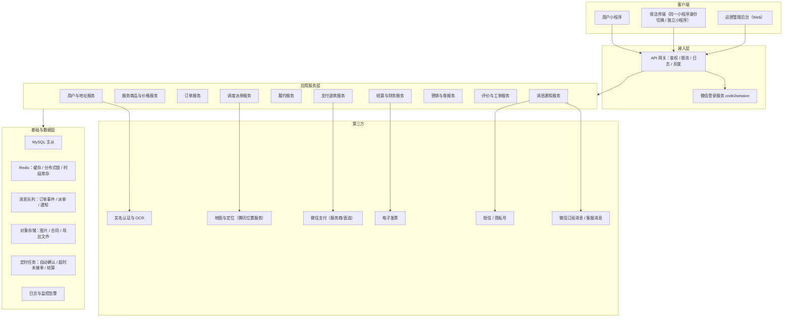
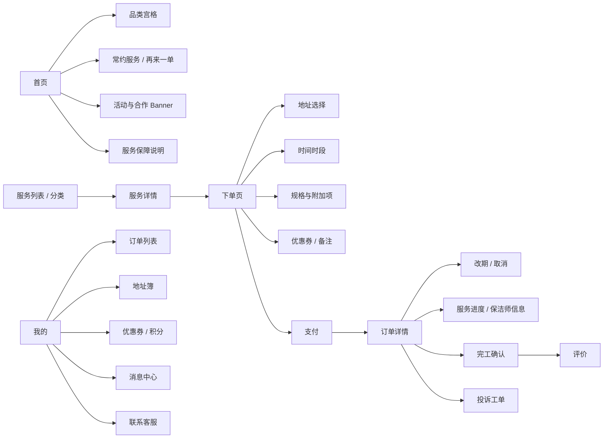
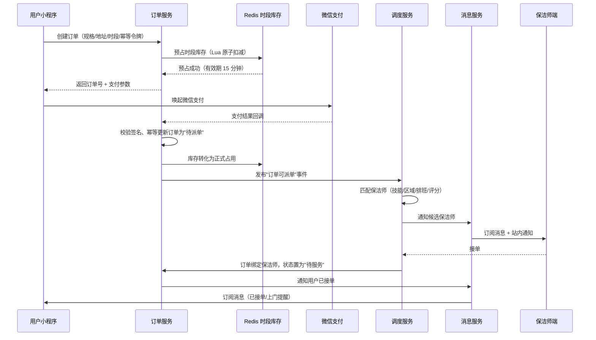
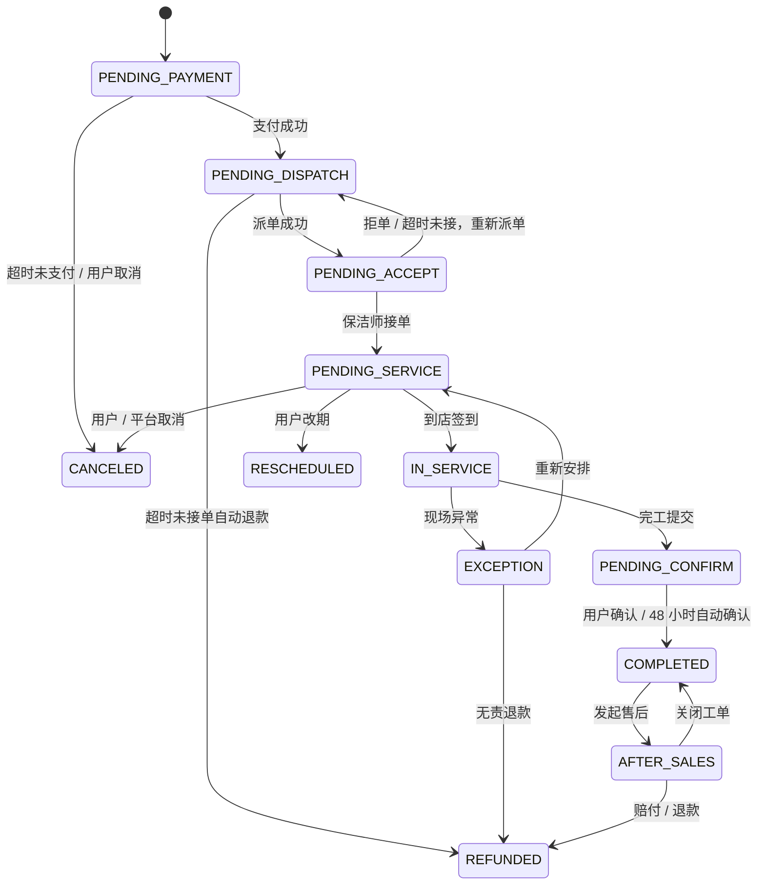
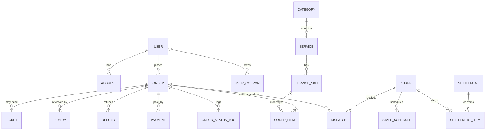
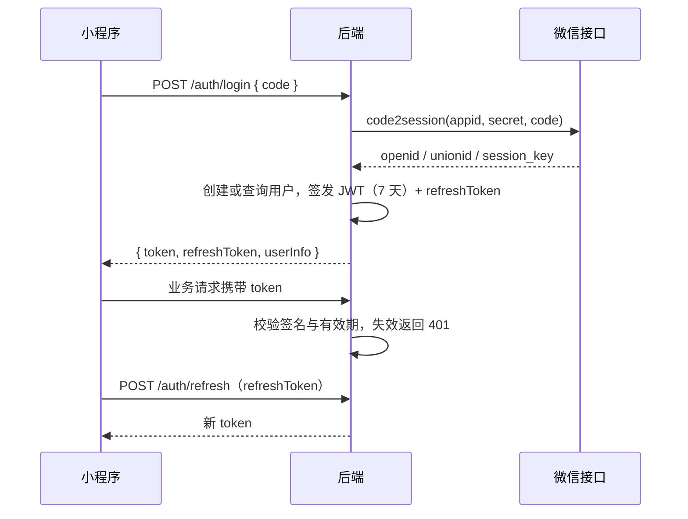

# 家政清洁服务微信小程序 · 设计文档

| 项目 | 内容 |
| --- | --- |
| 文档名称 | 家政清洁服务微信小程序设计文档 |
| 版本 | V1.0（初稿，待评审） |
| 日期 | 2026-10-03 |
| 适用阶段 | 立项评审 → 原型设计 → 研发落地 → 灰度上线 |
| 阅读对象 | 产品、设计、前端、后端、测试、运营、客服、财务 |

---

## 1. 项目概述

### 1.1 背景

家庭清洁属于高频、刚需、决策链路短的生活服务。传统获客依赖电话、微信群和本地中介，普遍存在四个问题：

1. **价格不透明**：用户不知道 2 小时日常保洁和 3 小时深度保洁该花多少钱，议价成本高。
2. **供给不可信**：保洁师资质、健康证、服务经验无从核验，用户对"陌生人进家门"存在天然顾虑。
3. **履约不可控**：迟到、临时放鸽子、服务范围扯皮、损坏物品责任不清。
4. **复购靠人**：用户与保洁师私下成交后平台流失，平台无法沉淀用户资产。

小程序是最贴合该类目的载体：免下载、可分享、可直接唤起微信支付，且订阅消息能低成本完成"接单通知—上门提醒—服务完成"的履约消息闭环。

### 1.2 目标

**业务目标**

- 跑通"在线选服务 → 选时段 → 支付 → 派单 → 上门履约 → 评价 → 复购"完整闭环。
- 建立可复用的保洁师供给池与调度能力，单个城市可独立运营。
- 沉淀用户地址、服务偏好、常约保洁师等资产，支撑次卡/会员等复购玩法。

**产品目标**

- 用户从进入小程序到完成支付，步数不超过 5 步，3 分钟内可下单。
- 运营侧可自助配置服务品类、价格、时段库存、活动，不依赖发版。

**核心指标（北极星 + 护栏）**

| 指标 | 定义 | MVP 目标 |
| --- | --- | --- |
| 有效完成订单数 | 状态流转到"已完成"的订单 | 周环比增长 |
| 下单转化率 | 支付订单数 / 进入下单页 UV | ≥ 8% |
| 支付成功率 | 支付成功订单 / 发起支付订单 | ≥ 92% |
| 准时上门率 | 按约定时间 ±15 分钟内签到 | ≥ 95% |
| 60 天复购率 | 60 天内下第二单的用户占比 | ≥ 25% |
| 差评率 | 1–2 星评价 / 有效评价 | ≤ 2% |
| 订单取消率 | 用户主动取消 / 总订单 | ≤ 15% |

### 1.3 范围界定

**MVP（第一期，必须做）**

- 日常保洁、深度保洁、家电清洗三大品类，支持按时长/按面积/按台数计价。
- 单城市运营，服务区域按行政区 + 小区白名单/黑名单配置。
- 微信支付、全额退款、改期、取消。
- 系统派单 + 运营人工派单兜底（抢单池作为 P1）。
- 订单履约：接单、出发、签到、完工拍照、用户确认。
- 评价、投诉工单、优惠券。
- 管理后台：订单、服务、价格、时段、保洁师、结算、数据看板。

**第二期（P1/P2）**

- 保洁师端（独立小程序或同一小程序的身份切换）、抢单池、智能推荐派单。
- 会员次卡 / 储值卡、拼团、老带新、邀请返券。
- 保洁师分账与自动结算、对账单、发票。
- 多城市多门店（区域化运营）、加盟商分润。
- 家电维修、月嫂育儿等预约制长周期服务。

**明确不做（避免范围蔓延）**

- 不做保洁师与用户的私聊/自由报价（风控与责任风险不可控）。
- MVP 不做竞价、拍卖式定价。
- MVP 不做跨城服务与跨境支付。
- 不做二级及以上分销（合规风险）。

### 1.4 名词术语

| 术语 | 含义 |
| --- | --- |
| SKU | 可售卖的服务规格，如"日常保洁 3 小时 / 两居室" |
| 服务时长/规格 | 计价维度，分为时长型、面积型、台件型、套餐型 |
| 时段库存 | 某一服务日期 + 时间段可接纳的订单量（受保洁师供给约束） |
| 派单 | 把已支付订单分配给具体保洁师的过程 |
| 抢单池 | 满足条件的订单对保洁师开放，先到先得 |
| 履约 | 从保洁师接单到用户确认完成的全部服务过程 |
| 次卡 | 预付费多次服务权益，如"10 次日常保洁卡" |
| 虚拟号 | 隐私号，保护双方手机号不外泄 |
| 结算单 | 平台按周期汇总应付保洁师的费用 |

---

## 2. 用户与场景

### 2.1 角色定义

| 角色 | 核心诉求 | 关键行为 | 使用端 |
| --- | --- | --- | --- |
| C 端用户（下单客户） | 快速找到可信的人、价格清楚、按时上门 | 浏览、下单、支付、改期、评价、复购 | 小程序 |
| 保洁师（服务者） | 订单稳定、收入透明、路线合理 | 接单/抢单、出发、签到、上传服务记录、申领提现 | 小程序（保洁师端） |
| 客服 | 快速定位纠纷、可操作补偿 | 查订单、改派、退款、发券、记录工单 | 后台 |
| 城市运营 | 控制供给与履约质量 | 排班、派单、保洁师招募与考核、活动配置 | 后台 |
| 财务 | 收款清楚、结算准确 | 对账、退款审核、生成结算单、打款 | 后台 |
| 平台管理员 | 全局配置与风控 | 权限、类目、费率、风控规则、数据看板 | 后台 |

### 2.2 典型用户画像

- **上班族妈妈（核心）**：一线/新一线城市，30–40 岁，双职工，周末需要深度保洁，对资质和准时最敏感，年消费频次 6–12 次。
- **独居青年**：25–32 岁，租房，每月 1–2 次日常保洁，价格敏感，习惯一次性下单，决策时间 < 2 分钟。
- **中老年家庭**：45 岁以上，需要擦玻璃、油烟机清洗等重体力服务，多用子女代下单，对电话沟通依赖强。
- **企业/装修后用户**：开荒保洁、办公室周期性保洁，客单价高，倾向走客服对接与对公结算（二期）。

### 2.3 核心使用场景

| 编号 | 场景 | 关键路径 | 设计要点 |
| --- | --- | --- | --- |
| S1 | 新用户首次下单 | 分享/搜索进入 → 首页选品类 → 选规格 → 选时间地址 → 支付 | 首页一屏内完成品类选择；新客首单券；免登录浏览、支付前一键授权 |
| S2 | 老用户复购（最高频） | 打开小程序 → "再来一单" → 选择新时间 → 支付 | 首页顶部展示"常约服务"卡片，一键复刻上次订单 |
| S3 | 指定常约保洁师 | 订单详情 → 选择"上次的保洁师" → 系统校验其排班 | 若该保洁师时段不可用，明确告知并推荐相似保洁师 |
| S4 | 改期/取消 | 订单详情 → 改期/取消 → 展示扣费规则 → 确认 | 规则外显、金额实时试算、退款进度可查 |
| S5 | 服务中/完成后确认 | 收到上门提醒 → 保洁师签到 → 完工确认 → 评价 | 订阅消息触达；验收清单；评价领取奖励 |
| S6 | 纠纷处理 | 提交投诉 → 上传照片 → 客服介入 → 补做/退款/赔付 | 工单闭环、时限 SLA、留存证据链 |
| S7 | 保洁师接单履约 | 收到派单通知 → 接单 → 出发打卡 → 签到 → 完工上传 | 移动网络弱环境可用；定位打卡；超时提醒 |

### 2.4 用户旅程与设计对策

| 阶段 | 用户行为 | 触点 | 典型痛点 | 设计对策 |
| --- | --- | --- | --- | --- |
| 认知 | 看到好友分享/朋友圈广告 | 小程序卡片 | 不信任平台 | 展示"已服务 XX 单""实名认证""保险承保"等信任背书 |
| 评估 | 比较价格与内容 | 服务详情页 | 不知道选多长时长 | 用房间数/面积智能推荐规格；服务清单可视化 |
| 决策 | 选时段、填地址 | 下单页 | 时段不可选、地址输入繁琐 | 微信地址一键导入；不可选时段置灰并给出最早可用时段 |
| 支付 | 微信支付 | 支付弹窗 | 担心付了没人来 | 支付前展示"超时未接单自动全额退款"承诺 |
| 等待 | 等接单/等上门 | 订阅消息、订单详情 | 不确定是否有人接单 | 状态实时可见；保洁师头像、评分、接单数可见 |
| 履约 | 现场沟通、服务 | 保洁师 + 小程序 | 服务范围扯皮 | 服务前电子确认清单；超范围需线上加价确认 |
| 完成 | 验收、评价 | 完工页 | 懒得评价 | 一键星级 + 标签化评价；评价得积分 |
| 复购 | 再来一单 | 首页、订单列表 | 忘记上次选择 | 复刻订单；次卡提醒 |

---

## 3. 需求分析

### 3.1 功能需求清单

优先级：P0 = MVP 必须，P1 = 第二期，P2 = 后续规划。

| 模块 | 编号 | 功能 | 优先级 |
| --- | --- | --- | --- |
| 首页 | H-01 | 定位城市/服务区域校验 | P0 |
| 首页 | H-02 | 品类宫格、Banner、活动位、常约服务卡片 | P0 |
| 首页 | H-03 | 搜索、门店列表 | P1 |
| 服务 | SV-01 | 分类列表、服务详情、服务清单、注意事项 | P0 |
| 服务 | SV-02 | 规格选择（时长/面积/台件）、附加项（擦玻璃、除螨） | P0 |
| 服务 | SV-03 | 规格智能推荐（按房型/面积） | P1 |
| 下单 | OR-01 | 服务地址选择/新增（微信地址导入、地图选点） | P0 |
| 下单 | OR-02 | 日期时段选择、时段余量、最早可用提示 | P0 |
| 下单 | OR-03 | 指定保洁师 / 随机分配 | P1 |
| 下单 | OR-04 | 优惠券、备注、加价项确认、费用明细 | P0 |
| 下单 | OR-05 | 下单预览、下单防重、超时未接单退款承诺 | P0 |
| 支付 | PY-01 | 微信支付（JSAPI）、支付结果页 | P0 |
| 支付 | PY-02 | 退款、部分退款、退款进度查询 | P0 |
| 订单 | OD-01 | 订单列表（全部/待服务/服务中/已完成/售后） | P0 |
| 订单 | OD-02 | 订单详情：状态、保洁师信息、倒计时、费用明细 | P0 |
| 订单 | OD-03 | 改期、取消（含费用试算与规则说明） | P0 |
| 订单 | OD-04 | 加价/减项、补差价支付 | P1 |
| 订单 | OD-05 | 发票申请 | P2 |
| 履约 | FU-01 | 接单通知、出发提醒、签到 | P0 |
| 履约 | FU-02 | 完工拍照上传、服务确认清单 | P0 |
| 履约 | FU-03 | 用户确认完工 / 超时自动确认 | P0 |
| 评价 | CM-01 | 星级 + 标签 + 图文评价 | P0 |
| 评价 | CM-02 | 投诉工单、客服介入、赔付 | P0 |
| 账户 | AC-01 | 微信授权登录、手机号绑定 | P0 |
| 账户 | AC-02 | 地址簿管理（家庭/公司标签、默认地址） | P0 |
| 账户 | AC-03 | 我的优惠券、积分、消息中心 | P0 |
| 账户 | AC-04 | 会员卡/次卡、储值 | P1 |
| 营销 | MK-01 | 新客券、满减券、限时折扣 | P0 |
| 营销 | MK-02 | 分享有礼、老带新、拼团 | P1 |
| 保洁师端 | ST-01 | 入驻申请、实名认证、健康证与资质上传 | P0 |
| 保洁师端 | ST-02 | 排班设置、接单/拒单、任务列表 | P0 |
| 保洁师端 | ST-03 | 抢单池、收入账单、提现 | P1 |
| 后台 | AD-01 | 订单管理、改派、强制退款 | P0 |
| 后台 | AD-02 | 服务与 SKU 管理、时段库存配置 | P0 |
| 后台 | AD-03 | 保洁师管理（审核、标签、考核、封禁） | P0 |
| 后台 | AD-04 | 财务对账、结算单、打款 | P0 |
| 后台 | AD-05 | 权限与角色管理、操作审计日志 | P0 |
| 后台 | AD-06 | 数据看板（订单、复购、准时率、差评） | P0 |

### 3.2 核心业务规则

**计价规则**

| 计价类型 | 示例 | 说明 |
| --- | --- | --- |
| 按时长 | 日常保洁 2/3/4 小时 | 单价 × 时长，超时按半小时叠加 |
| 按面积 | 深度保洁 8 元/㎡ | 面积区间档位定价，避免用户自填误差 |
| 按台件 | 油烟机清洗 159 元/台 | 多件享折扣 |
| 套餐 | 开荒保洁 3 小时 + 擦玻璃 | 组合价，不可拆 |

附加费规则：一层无电梯加收 X 元、超出 5 公里加收 X 元、节假日加价系数、夜间时段加价系数。所有加价项必须在支付前明示，禁止服务现场临时加价（改走线上"加项确认"）。

**时段与库存规则**

- 时段粒度 30 分钟，可选时段为 08:00–20:00。
- 时段剩余量 = min(该时段可用保洁师数 − 已占用数, 该时段配置上限)。
- 同一保洁师同一时段不允许连排冲突；服务时长 + 通勤缓冲（默认 60 分钟）一并占用排班。
- 距离开工 < 4 小时的时段需二次确认，避免保洁师来不及接单。

**取消与改期规则（默认，可在后台按品类调整）**

| 距离服务开始时间 | 用户取消 | 用户改期 |
| --- | --- | --- |
| > 24 小时 | 全额退款 | 免费，限 2 次 |
| 4–24 小时 | 退款 80% | 免费，限 1 次 |
| 1–4 小时 | 退款 50% | 退款 20% 手续费后改期 |
| < 1 小时 | 不退款（可协商转下期） | 不支持改期 |
| 平台/保洁师原因 | 全额退款 + 补偿券 | 免费改期，优先重派 |

**履约规则**

- 迟到 15 分钟以上：用户可申请补偿券；迟到 30 分钟以上：用户可无责取消并全额退款。
- 服务超范围：保洁师发起线上加项，用户确认后补差价，未确认不得服务。
- 物品损坏：24 小时内提交工单 + 照片，平台走保险或责任赔付流程。
- 用户确认完工或服务完成后 48 小时自动确认，触发结算与评价邀请。

### 3.3 非功能需求

| 维度 | 要求 |
| --- | --- |
| 性能 | 首页首屏 < 1.5s；核心接口 P95 < 300ms；下单接口 P99 < 800ms |
| 并发 | 支撑日常 200 QPS，大促峰值 1000 QPS（无状态水平扩容） |
| 可用性 | 核心链路（下单/支付/订单查询）月度可用性 ≥ 99.9% |
| 数据一致性 | 支付、订单、退款、库存四者最终一致，关键操作幂等 |
| 安全 | 全站 HTTPS、敏感字段加密存储、越权校验、防重放、防刷单 |
| 兼容性 | 微信基础库 ≥ 2.25，覆盖 iOS/Android 主流机型，兼容小屏 |
| 可维护性 | 服务可灰度、可回滚；关键操作有审计日志 |
| 无障碍易用 | 字号不小于 28rpx，主按钮点击区域 ≥ 88rpx |

---

## 4. 总体架构设计

### 4.1 架构图



### 4.2 技术选型

| 层次 | 选型 | 理由 |
| --- | --- | --- |
| 小程序框架 | 原生小程序 或 Taro（React）/ uni-app | 业务含定位、地图、支付，原生兼容性最好；如需同时输出支付宝/抖音端则选 Taro |
| UI 组件库 | TDesign miniprogram / Vant Weapp | 组件齐全、活跃维护、符合微信视觉 |
| 状态管理 | 原生 MobX-miniprogram 或 Taro 内置方案 | 控制订单流程的多步表单状态 |
| 后端语言 | Java（Spring Boot 3）或 Node.js（NestJS） | 团队熟悉度优先；订单/支付建议用强类型 + 事务支持好的方案 |
| 数据库 | MySQL 8.0（主从 + 读写分离） | 事务、报表、生态成熟 |
| 缓存 | Redis 7 | 时段库存、分布式锁、热点缓存 |
| 消息队列 | RocketMQ / RabbitMQ / Kafka | 订单事件解耦、派单与通知异步化 |
| 定时任务 | XXL-Job / Quartz | 自动确认、超时取消、结算 |
| 后台前端 | Vue 3 + Element Plus / React + Ant Design | 表格与表单密集场景 |
| 文件存储 | 腾讯云 COS / 阿里云 OSS | 图片、导出文件 |
| 部署 | 容器化 + K8s，或轻量云服务器 + Docker Compose | MVP 可先用轻量方案，预留扩容路径 |
| 监控 | Prometheus + Grafana + 日志服务 + 告警 | 核心接口与业务指标双监控 |

### 4.3 环境规划

| 环境 | 用途 | 数据 |
| --- | --- | --- |
| dev | 开发自测 | 造数，可重置 |
| test | 测试/联调，接微信支付沙箱 | 独立测试商户 |
| staging | 预发验收，与生产同配置 | 脱敏数据 |
| prod | 生产 | 正式数据，禁止直连改数据 |

配置项（支付商户号、密钥、订阅消息模板 ID、费率）统一走配置中心或加密环境变量，禁止硬编码在代码仓库。

---

## 5. 小程序端设计

### 5.1 信息架构



底部 Tab 建议 3 个：**首页 / 订单 / 我的**。保洁师身份登录时，底部 Tab 切换为 **任务 / 收入 / 我的**。

### 5.2 页面清单

| 页面 | 路径 | 核心内容 | 优先级 |
| --- | --- | --- | --- |
| 首页 | `pages/home/index` | 定位、品类、常约卡片、活动、保障说明 | P0 |
| 分类列表 | `pages/category/index` | 品类筛选、服务卡片、价格起 | P1 |
| 服务详情 | `pages/service/detail` | 图文介绍、服务清单、规格、可选附加项、评价 | P0 |
| 下单页 | `pages/order/create` | 地址、时间、规格、优惠券、备注、费用明细 | P0 |
| 地址列表/编辑 | `pages/address/list`、`pages/address/edit` | 地址簿、地图选点、标签 | P0 |
| 支付结果 | `pages/order/payResult` | 支付状态、下一步引导 | P0 |
| 订单列表 | `pages/order/list` | 分状态 Tab、订单卡片 | P0 |
| 订单详情 | `pages/order/detail` | 状态条、保洁师、费用、操作按钮 | P0 |
| 改期页 | `pages/order/reschedule` | 新时段选择、规则说明 | P0 |
| 评价页 | `pages/order/comment` | 星级、标签、图文、匿名 | P0 |
| 投诉工单 | `pages/support/ticket` | 原因选择、上传凭证、进度 | P0 |
| 我的 | `pages/mine/index` | 账户、券、积分、客服 | P0 |
| 优惠券 | `pages/coupon/list` | 可用/已用/过期 | P0 |
| 消息中心 | `pages/message/index` | 订单动态、活动通知 | P0 |
| 会员/次卡 | `pages/member/index` | 次卡购买、剩余次数 | P1 |
| 保洁师任务 | `pages/staff/task` | 待接单、进行中、已完成 | P0 |
| 保洁师签到 | `pages/staff/checkin` | 定位打卡、拍照 | P0 |
| 保洁师收入 | `pages/staff/income` | 账单、结算、提现 | P1 |

### 5.3 关键页面交互说明

**首页**

- 首屏自上而下：定位条（可切换城市/区域，未覆盖则提示并留手机号）→ 品类宫格（4–8 个）→ "常用服务/再来一单"卡片 → 活动位 → 服务保障（实名、保险、超时赔）。
- 老用户优先看到"上次的日常保洁 3 小时，￥159，再来一单"，直接进入下单页并预填规格与地址。

**服务详情页**

- 顶部图片轮播 + 价格区间 + 预计时长。
- 服务包含清单（做什么、不做什么）用分组清单展示，减少现场扯皮。
- 规格选择区支持按房间数/面积智能推荐默认值。
- 追加项以可勾选卡片呈现（擦玻璃、油烟机、冰箱、除螨），价格实时汇总。
- 底部吸底条：价格合计 + "立即预约"。

**下单页（转化关键页）**

- 字段顺序：服务信息（只读可改）→ 服务地址 → 服务时间 → 附加项/备注 → 优惠券 → 费用明细。
- 时段组件按"上午/下午/晚上"分组，已满时段置灰，并给出"最早可用：明天 09:00"的提示。
- 费用明细必须列出：服务费、附加项、楼层费、里程费、节假日加价、优惠券抵扣、实付。
- 首次点击"立即支付"前弹出下单须知（取消规则、超范围说明、宠物与贵重物品提醒）。
- 防重复下单：提交按钮点击后置灰 + 服务端幂等令牌（详见 6.6）。

**订单详情页**

- 顶部状态条按状态展示不同内容：待派单（倒计时 + 超时退款承诺）、待服务（保洁师信息卡 + 导航/联系）、服务中（开始时间 + 进度）、已完成（评价入口、再来一单）。
- 保洁师信息卡：头像、姓名、评分、接单数、服务标签、虚拟号拨号按钮。
- 底部主操作随状态变化，最多两个按钮，避免选择困难。

**保洁师任务页**

- 按"待接单 / 待服务 / 服务中 / 已完成"分 Tab，按服务时间倒序。
- 待接单卡片显示倒计时、距离、预估收入、接单/拒单按钮（拒单需选择原因，影响派单权重）。
- 签到按钮需在服务地址 500 米内且开启定位；弱网下本地缓存待提交，联网后自动重试。

### 5.4 下单主流程时序



超时兜底：支付后 X 分钟（默认 60 分钟；距开工 < 4 小时时为 15 分钟）仍未接单，定时任务自动全额退款并发放补偿券。

### 5.5 前端工程结构建议

```
miniprogram/
├─ app.js / app.json / app.wxss
├─ pages/                  # 页面
├─ packageStaff/           # 保洁师端分包
├─ components/             # 通用组件：时段选择器、价格明细、订单卡片
├─ services/               # 接口封装（按模块拆分）
├─ store/                  # 全局状态：用户、定位城市、下单草稿
├─ utils/                  # 请求、鉴权、金额格式化、埋点、位置
├─ constants/              # 枚举：订单状态、错误码、埋点编号
└─ assets/
```

工程约定：

- 主包体积控制在 1.5MB 以内，保洁师端与低频页面走分包。
- 请求统一拦截：注入 token、自动刷新登录态、统一错误提示、统一埋点。
- 订单状态、错误码等枚举唯一来源，避免页面里写魔法字符串。
- 关键操作（支付、取消、改期）二次确认，避免误触。

### 5.6 UI 规范要点

| 项 | 规范 |
| --- | --- |
| 主色 | 建议清爽蓝绿或暖橙（清洁/信任感），全局不超过 3 个主色 |
| 字号 | 正文 28rpx，次要 24rpx，标题 32–36rpx，价格加粗放大 |
| 圆角 | 卡片 16rpx，按钮 12rpx 或全圆角 |
| 间距 | 基础栅格 8rpx，页面左右边距 24rpx |
| 状态色 | 待支付橙、进行中蓝、已完成灰绿、异常/退款红 |
| 空态 | 每个列表页提供插画 + 文案 + 主行动按钮 |

---

## 6. 订单与调度设计（核心模块）

### 6.1 订单状态机

| 状态码 | 名称 | 说明 |
| --- | --- | --- |
| `PENDING_PAYMENT` | 待支付 | 已创建，未支付，15 分钟后自动关闭 |
| `PENDING_DISPATCH` | 待派单 | 已支付，等待派单 |
| `PENDING_ACCEPT` | 待接单 | 已派给保洁师，等待确认 |
| `PENDING_SERVICE` | 待服务 | 保洁师已接单，等待上门 |
| `IN_SERVICE` | 服务中 | 保洁师已签到开始服务 |
| `PENDING_CONFIRM` | 待确认 | 服务完成，等待用户确认 |
| `COMPLETED` | 已完成 | 用户确认或超时自动确认 |
| `RESCHEDULED` | 已改期 | 历史留痕（新时段以新状态继续流转） |
| `CANCELED` | 已取消 | 用户/平台取消 |
| `AFTER_SALES` | 售后中 | 投诉/赔付流程中 |
| `REFUNDED` | 已退款 | 全额或部分退款完成 |
| `EXCEPTION` | 异常 | 未签到、用户不在家、无法联系等 |



状态流转必须落在订单状态流水表中，记录操作者、时间、前后状态、原因，便于客服溯源。

### 6.2 派单调度策略

**三层策略**

1. **用户指定**（P1）：用户选择常约保洁师且其排班可用 → 直接派单，等待期 30 分钟。
2. **系统智能派单**（P0 主策略）：
   - 硬性过滤：城市/服务区域匹配、技能标签覆盖该 SKU、时段无冲突、未封禁、健康证与资质在有效期。
   - 打分排序：`得分 = 0.35×评分 + 0.20×接单率 + 0.15×准时率 + 0.15×距离得分 + 0.10×客户偏好 + 0.05×近期接单均衡度`。
   - 派单方式：按得分向 Top N（3–5 人）顺序派发，单人等待 3 分钟，超时转下一位；若全部超时则进入抢单池。
3. **人工派单兜底**（P0）：距开工 < 2 小时仍无人接单 → 后台告警，运营手动指派或电话协调。

**抢单池规则（P1）**

- 进入条件：距开工 > 6 小时且系统派单 15 分钟未成功。
- 可见范围：同等技能标签、同城、时段空闲的保洁师。
- 先到先得，服务端用 Redis 原子操作防止超卖。

**通勤约束**

- 同一保洁师相邻两单之间自动预留通勤时间（同小区 30 分钟，跨区 60 分钟，可配置）。
- 跨区订单在推荐时降权，避免一天跑遍全城。

### 6.3 改期、取消与退款

- 改期：校验新时段库存与保洁师排班；若原保洁师不可用，需重新派单，并明确告知用户。
- 取消：实时试算扣费金额并展示规则原文，用户确认后调用支付退款接口。
- 退款：原路退回；到账时间 1–7 个工作日；退款失败进入人工处理队列并告警。
- 平台原因取消（无人接单、保洁师爽约）：全额退款 + 补偿券 + 优先重派。
- 纠纷中的订单：`AFTER_SALES` 状态下冻结结算，待客服裁决。

### 6.4 履约过程设计

| 环节 | 参与方 | 系统动作 | 证据留存 |
| --- | --- | --- | --- |
| 接单 | 保洁师 | 状态置待服务，通知用户 | 接单时间、操作人 |
| 出发 | 保洁师 | 可选"已出发"，用户可看到预计到达 | 出发打卡时间、定位 |
| 签到 | 保洁师 | 定位校验（500m 内），状态置服务中 | 定位坐标、签到照片 |
| 服务中 | 双方 | 展示服务清单，可发起线上加项 | 加项确认记录 |
| 完工 | 保洁师 | 上传完工照片（默认 4 张：厨房/卫生间/客厅/整体） | 图片 + 时间戳 |
| 确认 | 用户 | 确认完工则置已完成；48 小时未操作自动确认 | 确认时间 |
| 评价 | 用户 | 评价入库，触发结算释放 | 评价内容 |

### 6.5 异常与兜底

| 异常 | 触发条件 | 系统处理 | 人工介入 |
| --- | --- | --- | --- |
| 超时未接单 | 支付后超过阈值 | 自动全额退款 + 补偿券 | 无需 |
| 保洁师未签到 | 开工后 15 分钟无签到 | 提醒保洁师 + 通知客服 | 客服电话核实 |
| 用户不在家 | 保洁师签到后无法入户 | 保洁师上报，等待 30 分钟 | 客服协调，可能扣除上门费 |
| 现场加项 | 服务超范围 | 线上加项确认，未确认不得服务 | 争议时客服介入 |
| 物品损坏 | 用户上报 | 生成工单，冻结结算 | 定损、保险/赔付 |
| 支付成功订单未更新 | 回调丢失 | 定时对账补偿 + 主动查询 | 财务核对 |
| 重复支付/重复派单 | 幂等失效 | 幂等键拦截 + 告警 | 财务退款 |

### 6.6 并发、幂等与一致性

- **下单幂等**：客户端生成 `requestId`，服务端建唯一索引；同一 `requestId` 只创建一次订单。
- **时段锁**：Redis Lua 脚本原子执行"校验余量 + 扣减"，预占 15 分钟，未支付自动释放。
- **支付回调幂等**：以微信支付单号 + 订单号建唯一约束，重复回调直接返回成功。
- **派单幂等**：派单操作使用分布式锁（`lock:dispatch:{orderId}`），保证同一订单同时只有一个派单流程。
- **抢单防超卖**：Redis 原子扣减 + 数据库乐观锁（`version` 字段）双保险。
- **最终一致**：订单状态变更通过消息队列驱动下游（结算、通知、统计），失败进重试队列并告警。

---

## 7. 管理后台设计

### 7.1 功能模块

| 模块 | 主要功能 |
| --- | --- |
| 工作台 | 今日订单、待派单、异常订单、投诉待处理、保洁师在线数 |
| 订单管理 | 查询/筛选、详情、改派、强制取消、退款审批、备注、导出 |
| 调度中心 | 待派单池、抢单池、人工派单、保洁师排班看板 |
| 服务管理 | 分类、服务、SKU、价格、附加项、上下架、服务清单文案 |
| 时段与区域 | 时段库存模板、服务区域（行政区/小区白名单）、节假日日历与加价 |
| 保洁师管理 | 入驻审核、实名与健康证、技能标签、考核、排班、封禁、等级 |
| 用户管理 | 用户查询、订单历史、标签、黑名单、异常行为 |
| 营销中心 | 优惠券模板、发放记录、活动配置、分享追踪 |
| 财务中心 | 收款明细、退款记录、对账单、结算单、打款、发票 |
| 客服工单 | 工单列表、SLA 计时、赔付审批、话术模板 |
| 评价管理 | 评价列表、差评跟进、申诉、屏蔽（需留痕） |
| 数据看板 | 订单漏斗、GMV、客单价、复购、准时率、差评率、保洁师效能 |
| 系统管理 | 账号、角色、权限、操作审计日志、配置项 |

### 7.2 角色权限矩阵（示例）

| 功能 | 客服 | 城市运营 | 财务 | 管理员 |
| --- | --- | --- | --- | --- |
| 查看订单 | 允许 | 允许 | 允许 | 允许 |
| 改派/取消订单 | 允许 | 允许 | 不允许 | 允许 |
| 发起退款 | 申请 | 审批 | 打款 | 允许 |
| 结算与打款 | 不允许 | 查看 | 允许 | 允许 |
| 保洁师审核 | 不允许 | 允许 | 不允许 | 允许 |
| 价格与活动配置 | 不允许 | 允许 | 不允许 | 允许 |
| 角色权限配置 | 不允许 | 不允许 | 不允许 | 允许 |

所有敏感操作（退款、改价、封禁、导出用户数据）必须记录操作审计日志：谁、何时、对什么对象、改成什么、原因。

---

## 8. 数据模型设计

### 8.1 ER 概览



### 8.2 核心表结构（关键字段）

> 通用字段：`id`（雪花 ID）、`created_at`、`updated_at`、`created_by`、`deleted_at`（软删除）。金额统一用 **分** 存储（`bigint`），避免浮点误差。

**user 用户表**

| 字段 | 类型 | 说明 |
| --- | --- | --- |
| id | bigint | 主键 |
| openid | varchar(64) | 微信 openid，唯一 |
| unionid | varchar(64) | 微信 unionid |
| nickname / avatar | varchar | 昵称头像 |
| phone | varchar(64) | 加密存储 |
| member_level | tinyint | 会员等级 |
| points | int | 积分 |
| status | tinyint | 正常/黑名单 |
| last_order_at | datetime | 最近下单时间 |

**address 服务地址表**

| 字段 | 类型 | 说明 |
| --- | --- | --- |
| id | bigint | 主键 |
| user_id | bigint | 用户 |
| contact_name / contact_phone | varchar | 联系人（手机号加密） |
| province / city / district | varchar | 行政区划 |
| community_id | bigint | 小区（用于白名单与派单） |
| detail | varchar(255) | 详细门牌 |
| lng / lat | decimal(10,7) | 经纬度 |
| floor / has_elevator | int / tinyint | 楼层与电梯（影响楼层费） |
| tag | varchar(16) | 家/公司 |
| is_default | tinyint | 默认地址 |

**category 服务分类表**：`id`、`name`、`icon`、`sort`、`status`。

**service 服务表**

| 字段 | 说明 |
| --- | --- |
| id / category_id / name | 主键、分类、名称 |
| cover_img / images | 封面与图集 |
| description | 图文介绍 |
| included_items | 服务包含项（JSON 数组） |
| excluded_items | 不包含项（JSON 数组） |
| notice | 注意事项 |
| price_type | 计价类型：duration / area / piece / package |
| base_price_min / base_price_max | 展示价格区间（分） |
| duration_minutes | 标准服务时长 |
| status / sort | 上下架、排序 |

**service_sku 服务规格表**：`id`、`service_id`、`name`（如"3 小时"）、`price`、`duration_minutes`、`area_min / area_max`、`staff_count`（需要几名保洁师）、`status`。

**service_addon 附加项表**：`id`、`name`、`price`、`unit`（项/台/㎡）、`duration_minutes`、`status`。

**time_slot 时段库存表**

| 字段 | 说明 |
| --- | --- |
| id / service_date / start_time / end_time | 主键、服务日期、起止时间 |
| city_code / district_code | 区域维度 |
| capacity | 可接单上限 |
| locked | 已预占（未支付） |
| used | 已确认占用 |
| status | 开放/关闭 |
| version | 乐观锁版本 |

**order 订单表（核心）**

| 字段 | 类型 | 说明 |
| --- | --- | --- |
| id | bigint | 主键 |
| order_no | varchar(32) | 业务订单号，唯一 |
| user_id | bigint | 下单用户 |
| address_snapshot | json | 地址快照（防止地址被改） |
| service_snapshot | json | 服务与规格快照（防止改价影响历史单） |
| service_date / start_time / end_time | date / time | 服务时间 |
| staff_id | bigint | 服务保洁师 |
| status | varchar(32) | 订单状态 |
| amount_service | bigint | 服务费（分） |
| amount_addon | bigint | 附加费 |
| amount_extra | bigint | 楼层/里程/节假日加价 |
| amount_discount | bigint | 优惠金额 |
| amount_payable | bigint | 实付金额 |
| coupon_id | bigint | 使用券 |
| remark | varchar(255) | 用户备注 |
| dispatch_deadline | datetime | 派单截止（超时退款） |
| paid_at / accepted_at / checkin_at / finished_at / confirmed_at / canceled_at | datetime | 关键时间点 |
| cancel_reason / cancel_by | varchar / tinyint | 取消原因与责任方 |
| version | int | 乐观锁 |

**order_item 订单明细表**：`id`、`order_id`、`item_type`（service/addon）、`item_id`、`name`、`price`、`quantity`、`duration_minutes`。

**order_status_log 状态流水表**：`id`、`order_id`、`from_status`、`to_status`、`operator_type`（user/staff/admin/system）、`operator_id`、`reason`、`created_at`。

**dispatch 派单表**：`id`、`order_id`、`staff_id`、`dispatch_type`（assign/grab/manual）、`status`（派发中/已接/已拒/超时）、`score`、`expire_at`、`responded_at`。

**staff 保洁师表**

| 字段 | 说明 |
| --- | --- |
| id / user_id / name / phone | 基本信息（手机号加密） |
| id_card_no / id_card_images | 实名信息（加密，仅授权可见） |
| health_cert_no / health_cert_expire_at | 健康证及有效期 |
| skill_tags | 技能标签（日常/深度/家电/开荒） |
| service_districts | 服务区域（JSON） |
| level / score / accept_rate / on_time_rate / order_count | 等级与质量指标 |
| status | 待审核/正常/暂停/封禁 |
| settlement_type / settlement_rate | 结算方式与分成比例 |

**staff_schedule 排班表**：`id`、`staff_id`、`work_date`、`start_time`、`end_time`、`status`（可接/已占用/请假）。

**payment 支付流水表**：`id`、`order_id`、`out_trade_no`、`transaction_id`（微信支付单号）、`amount`、`channel`、`status`、`paid_at`、`raw_callback`。

**refund 退款表**：`id`、`order_id`、`refund_no`、`amount`、`reason`、`status`（申请中/成功/失败）、`operator`、`refunded_at`。

**review 评价表**：`id`、`order_id`、`user_id`、`staff_id`、`score`（1–5）、`tags`、`content`、`images`、`is_anonymous`、`reply`。

**ticket 工单表**：`id`、`order_id`、`user_id`、`type`（投诉/损坏/退款/其他）、`description`、`images`、`status`、`handler_id`、`sla_deadline`、`resolution`。

**coupon / user_coupon 券表**：模板（名称、类型、门槛、面额、有效方式、发放量）+ 用户券（状态、领取时间、使用订单、有效期）。

**settlement / settlement_item 结算表**：周期、保洁师、订单数、应结金额、扣款、实结金额、状态、打款流水号。

### 8.3 关键设计说明

- **快照设计**：订单保存地址快照与服务快照，后续改价/改文案不影响历史订单，也便于纠纷举证。
- **金额一律用分**：前端展示时统一换算，禁止在业务代码中出现浮点金额运算。
- **索引建议**：`order(user_id, status, created_at)`、`order(order_no)` 唯一、`order(staff_id, service_date)`、`dispatch(order_id, status)`、`time_slot(service_date, district_code)`。
- **时区**：统一使用 `Asia/Shanghai`，数据库连接层显式设置时区，避免跨端时间错乱。
- **敏感字段**：手机号、身份证号加密存储（AES-256），日志中脱敏（保留前 3 后 2）。
- **归档策略**：超过 1 年的订单归档到历史库，主库仅保留近 12 个月用于查询与统计。

---

## 9. 接口设计

### 9.1 通用约定

- 协议：HTTPS + JSON，路径前缀 `/api/v1/`。
- 鉴权：请求头 `Authorization: Bearer <token>`。
- 统一响应结构：

```json
{
  "code": 0,
  "message": "ok",
  "data": {},
  "traceId": "a1b2c3d4"
}
```

- 分页：`?page=1&pageSize=20`，返回 `{ list, total, page, pageSize }`。
- 时间格式：`yyyy-MM-dd HH:mm:ss`；金额单位：分。
- 所有写操作携带 `requestId`（幂等）与客户端版本号。
- 接口版本升级通过新增 API 或字段兼容，禁止破坏性变更。

### 9.2 登录与鉴权流程



手机号获取：使用微信"手机号快速验证"组件（`getPhoneNumber`），后端用 `code` 换取手机号，不得把明文手机号落到前端日志。

### 9.3 接口清单

**登录与用户**

| 方法 | 路径 | 说明 |
| --- | --- | --- |
| POST | `/auth/login` | 微信登录，返回 token |
| POST | `/auth/refresh` | 刷新 token |
| POST | `/user/phone` | 绑定手机号 |
| GET | `/user/profile` | 用户信息、积分、券数量 |
| POST | `/user/feedback` | 意见反馈 |

**服务与商品**

| 方法 | 路径 | 说明 |
| --- | --- | --- |
| GET | `/categories` | 服务分类 |
| GET | `/services` | 服务列表（分类/关键词/分页） |
| GET | `/services/{id}` | 服务详情（含 SKU 与附加项） |
| GET | `/services/{id}/reviews` | 服务评价列表 |
| GET | `/services/{id}/recommend-sku` | 按房型/面积推荐规格 |

**地址**

| 方法 | 路径 | 说明 |
| --- | --- | --- |
| GET | `/addresses` | 地址列表 |
| POST | `/addresses` | 新增地址 |
| PUT | `/addresses/{id}` | 修改地址 |
| DELETE | `/addresses/{id}` | 删除地址 |
| GET | `/areas/check` | 校验是否在服务范围 |

**时段与价格**

| 方法 | 路径 | 说明 |
| --- | --- | --- |
| GET | `/time-slots` | 查询指定日期可预约时段与余量 |
| POST | `/price/calculate` | 价格试算（规格 + 附加项 + 地址 + 时间 + 券） |

**订单**

| 方法 | 路径 | 说明 |
| --- | --- | --- |
| POST | `/orders` | 创建订单（预占时段） |
| GET | `/orders` | 订单列表（状态筛选、分页） |
| GET | `/orders/{id}` | 订单详情 |
| POST | `/orders/{id}/cancel` | 取消订单（返回试算金额） |
| POST | `/orders/{id}/reschedule` | 改期 |
| POST | `/orders/{id}/confirm` | 确认完工 |
| POST | `/orders/{id}/addon` | 申请加项（服务中） |
| POST | `/orders/{id}/addon/confirm` | 用户确认加项 |
| GET | `/orders/{id}/status-log` | 状态流转记录 |
| POST | `/orders/{id}/repeat` | 再来一单（复制成草稿） |

**支付与退款**

| 方法 | 路径 | 说明 |
| --- | --- | --- |
| POST | `/payments/prepay` | 获取微信支付参数 |
| POST | `/payments/notify` | 微信支付回调（内部接口） |
| GET | `/payments/{orderId}` | 支付状态查询 |
| POST | `/refunds` | 申请退款（后台/客服） |
| GET | `/refunds/{orderId}` | 退款进度 |

**履约与评价**

| 方法 | 路径 | 说明 |
| --- | --- | --- |
| GET | `/staff/tasks` | 保洁师任务列表 |
| POST | `/staff/tasks/{id}/accept` | 接单 |
| POST | `/staff/tasks/{id}/reject` | 拒单（需填原因） |
| POST | `/staff/tasks/{id}/depart` | 出发打卡 |
| POST | `/staff/tasks/{id}/checkin` | 到店签到（定位校验） |
| POST | `/staff/tasks/{id}/finish` | 完工提交（含图片） |
| GET | `/staff/income` | 收入与账单 |
| POST | `/reviews` | 提交评价 |
| POST | `/tickets` | 提交投诉工单 |
| GET | `/tickets/{id}` | 工单进度 |

**营销与消息**

| 方法 | 路径 | 说明 |
| --- | --- | --- |
| GET | `/coupons` | 我的优惠券 |
| POST | `/coupons/{id}/claim` | 领券 |
| GET | `/messages` | 消息中心 |
| POST | `/messages/subscribe` | 上报订阅消息授权 |
| GET | `/home/config` | 首页配置（品类、Banner、保障文案） |

**管理后台（示例）**

| 方法 | 路径 | 说明 |
| --- | --- | --- |
| GET | `/admin/orders` | 订单查询 |
| POST | `/admin/orders/{id}/dispatch` | 人工派单 |
| POST | `/admin/orders/{id}/cancel` | 强制取消 |
| POST | `/admin/refunds/{id}/approve` | 退款审批 |
| CRUD | `/admin/services`、`/admin/skus` | 服务与规格管理 |
| CRUD | `/admin/staff` | 保洁师管理与审核 |
| GET | `/admin/dashboard` | 数据看板 |
| POST | `/admin/settlements/generate` | 生成结算单 |

### 9.4 错误码规范

| 区间 | 含义 | 示例 |
| --- | --- | --- |
| 0 | 成功 | — |
| 40000–40999 | 参数错误 | 40001 缺少必填参数 |
| 40100–40199 | 鉴权失败 | 40101 token 过期 |
| 40300–40399 | 无权限 | 40301 越权访问订单 |
| 40900–40999 | 业务冲突 | 40901 时段已满、40902 订单状态不允许该操作 |
| 42900 | 频率限制 | 42901 请求过于频繁 |
| 50000+ | 系统错误 | 50001 服务异常 |

### 9.5 幂等与防刷

- 创建订单、支付、退款、抢单四类接口必须幂等。
- 下单接口按 `userId` 做频控（如 10 秒 1 次、1 分钟 5 次），异常账号触发风控校验。
- 优惠券核销使用数据库唯一约束 + 事务，防止并发重复用券。
- 抢单接口使用 Redis 分布式锁 + 数据库行锁。

---

## 10. 支付、退款与结算

### 10.1 支付方式

- 主渠道：微信支付 JSAPI（小程序内）。
- 商户模式：平台自营用**直连商户**；若引入第三方家政公司入驻，则需要**服务商模式 + 分账**。
- 必备资质：企业主体营业执照、对公账户、微信支付商户号、小程序类目资质。

### 10.2 支付流程要点

1. 创建订单 → 预占时段 → 调用统一下单获取 `prepay_id` → 返回小程序支付参数。
2. 用户支付 → 微信异步回调 `/payments/notify` → 验签 → 幂等更新订单 → 发布订单事件。
3. 回调丢失兜底：每 5 分钟主动查询未支付订单状态（按 `out_trade_no`），最长查询 24 小时。
4. 支付超时：15 分钟未支付自动关闭订单并释放时段库存。

### 10.3 退款

- 全额退款：无人接单、平台原因取消、服务未发生。
- 部分退款：用户超时取消、服务时长不足、投诉裁决。
- 退款发起需记录原因与审批人；金额超过阈值（如 500 元）需二级审批。
- 退款状态机：`申请中 → 审核通过 → 退款中 → 成功/失败`；失败自动告警并进入人工队列。
- 退款成功后按规则回滚优惠券与积分，并同步调整保洁师结算。

### 10.4 保洁师结算

| 项 | 说明 |
| --- | --- |
| 结算周期 | 默认 T+1 生成，周结或月结可配置 |
| 结算基数 | 订单实付金额（扣除优惠券后） |
| 分成比例 | 按级别/品类配置，如 70% |
| 扣款项 | 迟到、投诉成立、物料损耗、平台罚款 |
| 生效条件 | 订单已完成且过售后保护期（默认 72 小时） |
| 打款方式 | 微信商家转账 / 银行代付 |
| 对账 | 结算单与订单明细逐条可核对，支持导出 |

### 10.5 对账

- 每日拉取微信支付账单，与本地支付流水逐笔比对，差异生成异常清单。
- 三方数据核对：订单金额 = 支付金额 − 退款金额 + 平台补贴。
- 对账异常分三类：本地有微信无、微信有本地无、金额不一致；由财务每日处理并留痕。

---

## 11. 消息与通知

### 11.1 订阅消息模板（建议，需在微信后台申请）

| 场景 | 接收方 | 模板类目示例 | 触发时机 |
| --- | --- | --- | --- |
| 下单成功 | 用户 | 订单支付成功通知 | 支付回调成功 |
| 已接单 | 用户 | 服务人员接单通知 | 保洁师接单 |
| 上门提醒 | 用户 | 服务即将开始提醒 | 开工前 2 小时 |
| 服务完成 | 用户 | 服务完成待确认通知 | 保洁师完工 |
| 退款到账 | 用户 | 退款结果通知 | 退款成功 |
| 新订单 | 保洁师 | 新任务通知 | 派单/抢单池 |
| 派单超时警告 | 保洁师 | 任务即将超时 | 派单后 2 分钟 |
| 结算到账 | 保洁师 | 收入到账通知 | 打款成功 |

注意：微信订阅消息为**一次性订阅**，需在下单、完工等关键节点引导用户授权；每次授权仅可发送一条，因此要设计"授权引导 + 站内消息 + 短信"的多通道兜底策略。

### 11.2 其他触达

- 站内消息中心：所有通知留存，避免用户漏看。
- 短信：仅用于关键节点（上门提醒、退款、异常），控制成本。
- 隐私号：保洁师与用户通话走虚拟号，服务结束后 24 小时自动失效。
- 客服：小程序内在线客服入口 + 400 电话，工作时间内 3 分钟响应。

---

## 12. 安全与合规

### 12.1 资质与备案

| 项 | 要求 |
| --- | --- |
| 小程序主体 | 企业/个体工商户（个人主体无法开通微信支付） |
| 类目资质 | 生活服务/家政类目，部分需提供营业执照与行业许可 |
| 支付资质 | 微信支付商户号、对公账户；涉及分账需服务商资质 |
| 域名备案 | 后端域名需 ICP 备案（境内服务器） |
| 增值电信业务 | 涉及经营性服务可能需 ICP 许可证，按当地要求确认 |
| 家政信用 | 建议对接商务部家政服务信用信息平台，核验服务人员信用记录 |

### 12.2 个人信息保护（重点）

依据《个人信息保护法》《网络安全法》及 App 必要个人信息范围相关规定：

- **最小必要**：仅收集下单必需信息（手机号、地址、定位），不做与业务无关的采集。
- **单独同意**：定位、通讯录、相册权限分别说明用途并单独弹窗授权；拒绝授权也应能使用非定位功能（手动选区域）。
- **隐私政策**：首次启动展示，明确收集字段、用途、保存期限、共享第三方（支付、地图）清单。
- **账号注销**：提供在线注销入口，注销后按规定期限删除或匿名化处理。
- **数据安全**：手机号、身份证加密存储，数据库最小权限访问，导出操作全量审计。
- **保洁师信息**：身份证、健康证属敏感个人信息，需单独告知并取得同意，仅授权人员可见。
- **人脸识别**：如确需实人认证，必须有独立同意与替代方案，不得强制。

### 12.3 交易与资金安全

- 支付回调必须验签 + 金额比对，防止伪造回调。
- 退款接口仅限服务端调用，前端不得传金额。
- 优惠券、积分发放有上限与风控规则，防刷单套利。
- 大额订单与异常高频账号进入人工审核。

### 12.4 内容与风控

- 评价与客服对话做敏感词过滤，含联系方式的内容自动拦截（防止绕过平台私下成交）。
- 保洁师端禁止直接展示用户手机号，全程走虚拟号。
- 建立双向黑名单：频繁取消、恶意投诉的用户；爽约、差评率高的保洁师。
- 保洁师拒单率、爽约率与派单权重挂钩，形成自动约束。

### 12.5 保险与责任

- 建议为每单投保家政服务责任险，覆盖物品损坏与第三者责任。
- 为保洁师投保意外险（人身伤害）。
- 服务协议明确：贵重物品需用户自行收纳告知、宠物管理责任、不可抗力免责。

---

## 13. 非功能设计

### 13.1 容量估算（单城市示例）

| 指标 | 假设 | 结果 |
| --- | --- | --- |
| 日订单量 | 2000 单 | — |
| 峰值集中度 | 40% 集中在 2 小时 | 约 400 单/小时 |
| 峰值下单 QPS | 400 单 × 5 次请求 / 3600 秒 | 约 0.6 QPS（很轻） |
| 峰值读 QPS | 下单相关页面 PV 放大 50 倍 | 约 30 QPS |
| 大促放大 | ×20 | 约 600 QPS |
| 存储量 | 2000 单/日 × 2KB × 365 天 | 约 1.5GB/年（含日志约 10GB） |

结论：MVP 阶段用「2 台应用服务器 + MySQL 主从 + Redis」即可支撑，工程重点在幂等与削峰，而非绝对性能。

### 13.2 可用性与容灾

- 无状态服务多实例部署，负载均衡 + 健康检查，实例故障自动摘除。
- MySQL 主从 + 每日全量备份 + binlog，RPO ≤ 5 分钟，RTO ≤ 30 分钟。
- Redis 开启持久化；库存以数据库为准，Redis 仅做加速。
- 支付、派单、通知链路支持失败重试与人工补偿。
- 降级策略：消息推送失败降级为短信/站内信；地图不可用时降级为手动输入地址。

### 13.3 监控与告警

| 类别 | 指标 | 阈值示例 |
| --- | --- | --- |
| 接口 | P95 耗时、错误率 | P95 > 500ms 或错误率 > 1% |
| 业务 | 支付成功率、派单成功率 | 支付成功率 < 90% 告警 |
| 业务 | 待派单超时数、异常订单数 | 超过 5 单立即告警 |
| 系统 | CPU/内存/连接数/队列堆积 | 队列积压超过 1000 条告警 |
| 数据 | 对账差异笔数 | 大于 0 需人工确认 |

### 13.4 发布与回滚

- 小程序：体验版 → 审核 → 灰度（按用户比例）→ 全量；后端接口保持向前兼容至少一个版本。
- 后台：按模块灰度上线，配置类改动支持一键回滚。
- 数据库变更走版本化迁移脚本，禁止手工修改生产数据。

---

## 14. 埋点与数据分析

### 14.1 核心埋点

| 事件 | 触发 | 关键属性 |
| --- | --- | --- |
| `page_view` | 页面浏览 | 页面 ID、来源、渠道 |
| `service_view` | 服务详情浏览 | 服务 ID、默认规格 |
| `order_create_click` | 点击立即预约 | 服务 ID、规格、价格 |
| `order_submit` | 提交订单 | 金额、时段、是否用券 |
| `pay_start` / `pay_success` / `pay_fail` | 支付过程 | 金额、失败原因 |
| `order_cancel` / `order_reschedule` | 取消/改期 | 原因、距开工时长 |
| `order_complete` | 订单完成 | 服务时长、保洁师 |
| `review_submit` | 提交评价 | 星级、标签 |
| `repeat_order` | 再来一单 | 来源位置 |

### 14.2 核心分析看板

- **转化漏斗**：首页 UV → 详情 UV → 下单页 UV → 提交订单 → 支付成功。
- **转化质量**：下单转化率、支付成功率、取消率，按渠道/品类/时段拆解。
- **供给健康度**：保洁师在线数、人均单量、接单率、准时率、拒单原因分布。
- **履约质量**：准时上门率、按时完成率、异常率、投诉率、差评原因 Top 10。
- **用户留存**：7/30/60 天复购率、次卡留存、常约保洁师占比。
- **财务表现**：GMV、客单价、退款率、券成本、平台毛利率。

---

## 15. 项目计划与里程碑

以 MVP 8 周为例（可按团队规模压缩或延长）：

| 阶段 | 周期 | 产出 | 负责方 |
| --- | --- | --- | --- |
| 需求与设计 | 第 1–2 周 | 需求评审、原型、本设计文档评审、技术方案 | 产品 + 设计 + 技术 |
| 基础搭建 | 第 2 周 | 账号体系、域名备案、支付商户对接、环境搭建 | 后端 + 运维 |
| 核心开发 | 第 3–6 周 | 服务、下单、支付、派单、履约、后台 | 全团队 |
| 联调与测试 | 第 7 周 | 功能测试、支付回归、异常场景、兼容性 | 测试 + 研发 |
| 灰度上线 | 第 8 周 | 单城市小范围灰度、数据监控、问题修复 | 全团队 |
| 正式运营 | 第 9 周起 | 全量推广、保洁师招募、复购运营 | 运营 |

关键交付物清单：需求文档、原型图、UI 稿、接口文档、测试用例、上线 checklist、应急预案、运营手册、客服话术。

---

## 16. 风险与对策

| 风险 | 影响 | 概率 | 对策 |
| --- | --- | --- | --- |
| 保洁师供给不足 | 接单率低、退款率高 | 高 | 提前招募 + 保底补贴 + 抢单池 + 人工派单兜底 |
| 履约质量不稳定 | 差评与投诉 | 高 | 标准化服务清单 + 培训 + 考核 + 保险 + 快速赔付 |
| 用户与保洁师私下成交 | 平台流失 | 中 | 虚拟号、禁止交换联系方式、次卡与会员绑定、服务保障差异化 |
| 支付/退款纠纷 | 客诉与资金风险 | 中 | 规则外显、退款试算、工单 SLA、全程留痕 |
| 类目/资质审核不通过 | 无法上线 | 中 | 提前准备营业执照与行业资质，先做资质预审 |
| 订阅消息触达有限 | 用户漏看通知 | 高 | 多节点引导授权 + 短信兜底 + 站内消息 |
| 数据合规问题 | 监管风险 | 中 | 隐私政策、最小必要、加密存储、定期合规自查 |
| 高峰期时段超卖 | 履约事故 | 中 | Redis 原子扣减 + 数据库约束 + 定期核对库存 |
| 派单算法不成熟 | 匹配效率低 | 中 | 先用规则型打分，后续用真实数据迭代优化 |

---

## 17. 附录

### 17.1 订单状态枚举（前后端共用）

```
PENDING_PAYMENT   待支付
PENDING_DISPATCH  待派单
PENDING_ACCEPT    待接单
PENDING_SERVICE   待服务
IN_SERVICE        服务中
PENDING_CONFIRM   待确认
COMPLETED         已完成
RESCHEDULED       已改期
CANCELED          已取消
AFTER_SALES       售后中
REFUNDED          已退款
EXCEPTION         异常
```

### 17.2 常见错误码

| 错误码 | 含义 | 用户提示 |
| --- | --- | --- |
| 40901 | 时段已满 | 该时段已约满，请选择其他时间 |
| 40902 | 状态不允许操作 | 当前状态无法执行该操作 |
| 40903 | 地址超出服务范围 | 该地址暂未开通服务 |
| 40904 | 优惠券不可用 | 优惠券不满足使用条件 |
| 40101 | 登录已过期 | 请重新登录 |
| 50001 | 系统异常 | 服务开小差了，请稍后重试 |

### 17.3 上线前 Checklist

- [ ] 微信支付商户号、证书、回调域名配置完成
- [ ] 小程序类目与资质审核通过
- [ ] 隐私政策、用户协议、服务条款、取消规则页面齐全
- [ ] 定位/相册/手机号授权文案合规，拒绝授权可降级使用
- [ ] 支付全链路回归（成功、失败、取消、退款、重复回调）
- [ ] 派单超时自动退款逻辑验证
- [ ] 库存并发压测（模拟 100 并发抢同一时段）
- [ ] 敏感数据加密与日志脱敏检查
- [ ] 监控告警、值班表、应急预案就绪
- [ ] 客服话术与赔付标准培训完成
- [ ] 灰度方案与回滚方案确认

### 17.4 参考资料

- 微信开放文档：小程序登录、微信支付、订阅消息、位置服务
- 《中华人民共和国个人信息保护法》
- 《中华人民共和国电子商务法》
- 《消费者权益保护法》
- 商务部家政服务信用信息平台相关规范
- 微信小程序平台运营规范与类目要求

---

**文档结束**。如需求或技术方案发生变更，请在本文件追加修订记录并同步版本号。

| 版本 | 日期 | 修订人 | 说明 |
| --- | --- | --- | --- |
| V1.0 | 2026-10-03 | — | 初稿 |
